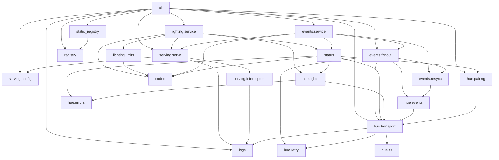
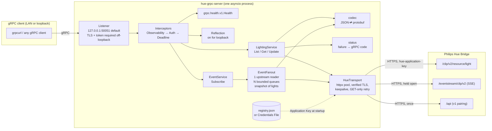
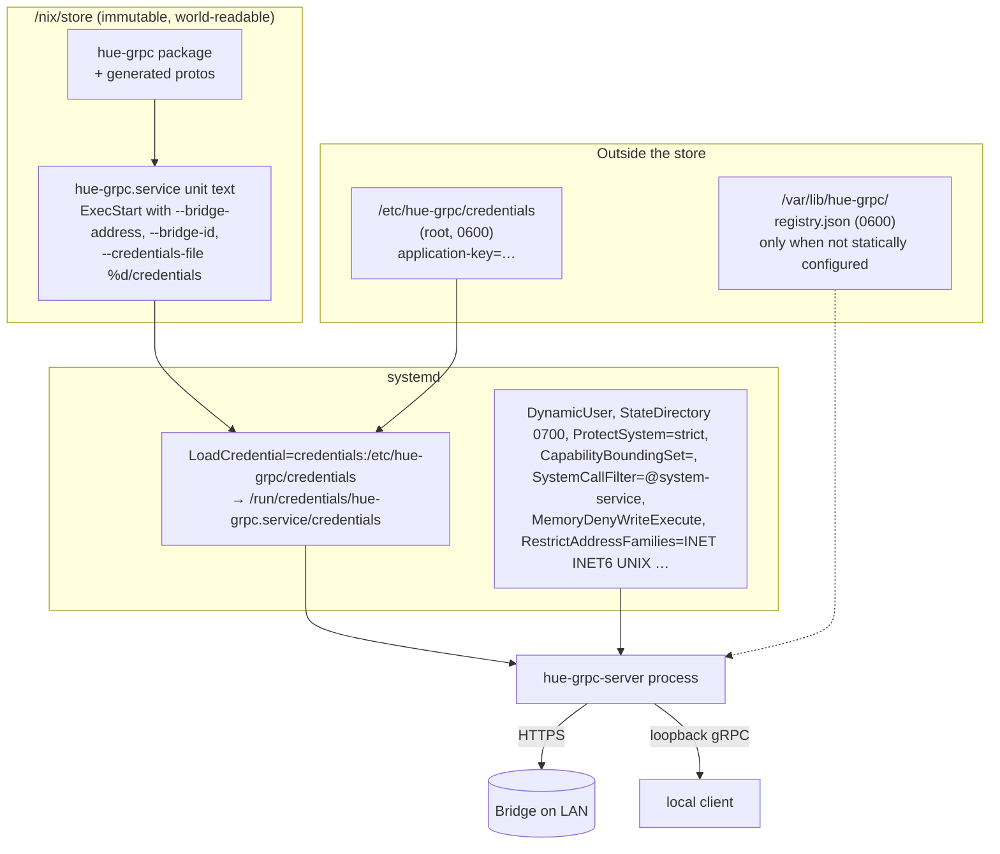

# Repository analysis: `malamoney/hue` (hue-grpc)

Analysed at commit `6a1dd1f` (2026-09-15), from a local checkout of `main`.

## TL;DR

`hue-grpc` is a small, single-purpose Python 3.12 service that exposes five
Philips Hue operations (pair, list lights, get light, update light, event
stream) over gRPC, packaged as a Nix flake with a hardened NixOS systemd
module. It is ~4.5k lines of runtime code with ~7.7k lines of tests, written
in nine days by one author in 21 pull requests, and is running in production
on a NixOS box against a real bridge.

The codebase is unusually deliberate for its size: a domain glossary
(`CONTEXT.md`), seven ADRs, a strict layering that keeps gRPC and Hue-HTTP
knowledge apart, secrets that never touch the Nix store or a command line,
and a booted-VM integration test. The main risks are not in what exists but
in what is thin: no release tagging, no coverage measurement, a background
event reader that can die silently while health still says `SERVING`, and
several registry fields that are declared but never populated.

---

## 1. Architecture & structure

### 1.1 Overall architecture

A **single-process asyncio gateway** (a protocol translator), not a
monolith-with-modules and not microservices. One process holds one HTTPS
connection pool to one Hue Bridge and serves one gRPC listener. There is no
database, no web framework, no message broker.

Internally it is **layered, ports-and-adapters style**, with the layering
enforced by import direction rather than by tooling:

```
cli                       composition root: flags -> config -> wire everything
 ├─ serving/              gRPC host machinery (listener, health, reflection,
 │                        interceptors, shutdown). Knows nothing about Hue.
 ├─ lighting/service      thin servicer: LightingService RPCs
 ├─ events/service        thin servicer: EventService.Subscribe
 ├─ events/fanout, resync one upstream stream -> N bounded subscriber queues
 ├─ status                table: Hue failure -> gRPC status code
 ├─ codec                 Hue JSON <-> protobuf, descriptor-driven, pure
 ├─ registry, static_registry   the persisted Bridge record, pure
 ├─ logs                  structured logging + correlation-id contextvar
 └─ hue/                  Bridge client: transport, tls, retry, pairing,
                          lights, events, errors. Knows nothing about gRPC.
```

### 1.2 Directory layout

| Path | Purpose |
|---|---|
| `src/hue_grpc/` | The runtime package (the Gateway). |
| `src/hue/` | **Generated, gitignored.** protoc output (`*_pb2.py`, `*_pb2_grpc.py`, `.pyi`). Regenerated on dev-shell entry and in the Nix build. |
| `proto/hue/v1/*.proto` | Wire contract. `common`, `lighting`, `events` are generated from OpenAPI; `lighting_service` and `event_service` are hand-written. |
| `proto/manifest.toml`, `proto/field-numbers.json` | Generator config and the committed field-number lock (ADR 0003). |
| `openapi.yaml` | Vendored OpenHue OpenAPI spec (9.7k lines), the seed for the generated protos. |
| `tools/protogen/` | The OpenAPI-to-proto generator (ADR 0001). Build tooling, not shipped. |
| `tools/fake_hue/` | A fake Hue Bridge (TLS, CLIP v2 envelope, SSE, v1 pairing) used by the VM test. Packaged separately as `packages.fake-hue`. |
| `tests/unit/` | 266 pure-Python tests, run on macOS and inside the Nix build. |
| `tests/protogen/`, `tests/fake_hue/` | 68 + 15 tests for the tooling, each with its own flake check. |
| `tests/smoke/` | 10 tests against a real Bridge, gated by env vars, never run in CI. |
| `nix/package.nix` | `buildPythonApplication` with codegen in `preBuild`. |
| `nix/module.nix` | `services.hue-grpc` NixOS module and the hardened unit. |
| `nix/integration-test.nix` | Three-node booted VM test (`checks.integration-vm`). |
| `nix/fake-hue.nix` | Package for the fake Bridge. |
| `flake.nix` | Packages, apps, dev shell, ten checks, formatter, `nixosModules`. |
| `scripts/deploy-and-smoke-test.sh` | 671-line interactive wizard for deploying to real hardware and smoke-testing. |
| `docs/adr/` | Seven architecture decision records. |
| `CONTEXT.md` | Domain glossary with terms to use and terms to avoid. |
| `philips-hue-grpc-nixos-plan.md` | The original 1,062-line project plan, with corrections folded in (issue #17). |
| `.github/workflows/ci.yml` | One job: `nix flake check --all-systems`, build, `--version`. |

### 1.3 Modules and their relationships

The internal import graph, derived from the source:



**There are no circular dependencies.** The graph is a DAG with clear strata:

1. Leaves with no internal imports: `codec`, `registry`, `logs`, `hue.tls`,
   `hue.retry`, `hue.errors`, `serving.config`.
2. `hue.*` (Bridge client) imports only within `hue/` plus `logs`.
3. `status`, `lighting.limits`, `static_registry` sit above the Bridge layer.
4. The two servicers import `serving.serve` for the `HostedService` type only.
5. `cli` is the sole composition root.

`logs` is deliberately top-level so that both `serving` (which writes the
per-RPC log line) and `hue` (which records the upstream HTTP status several
frames down) can use it without either importing the other. The generated
`hue.v1` package is imported only by the two servicers and `codec` never
imports it at all — `codec` works from protobuf descriptors, so it is
schema-agnostic.

### 1.4 Design patterns in use

| Pattern | Where |
|---|---|
| Ports & adapters / layered | `hue/` is the Bridge adapter; servicers are the gRPC adapter; `codec`/`status` are pure translation between them. |
| Composition root + constructor injection | `cli._serve` builds `HueTransport -> Lights/BridgeEvents -> EventFanout -> HostedService` and hands them to `serve`. |
| Protocol-typed seams for tests | `EventSource`, `LightReader` in `fanout.py`; the fanout is tested by ending a fake stream. |
| Interceptor chain (chain of responsibility) | `ObservabilityInterceptor -> AuthInterceptor -> DeadlineInterceptor`, ordered outside-in, each replacing handler behaviour while preserving cardinality. |
| Ambient context via `ContextVar` | Correlation ID and upstream HTTP status flow across layers without threading arguments. |
| Fan-out with bounded, drop-and-announce queues | `Subscription.offer` never blocks; overflow becomes a `Gap(SUBSCRIBER_BEHIND, missed=n)`. |
| Strategy objects with injectable randomness | `Retry`, `Backoff`, both taking a `jitter` callable so tests can see the schedule. |
| Immutable value objects with redacted `__repr__` | `RegistryEntry`, `PairedSecrets`, `BridgeCredentials`, `GatewayConfig`. |
| Table-driven mapping | `status.py` is one function mapping exception type / HTTP code to gRPC status. |
| Descriptor-driven generic codec | `codec.decode/encode` walk `message.DESCRIPTOR` — no per-message code. |
| Async context managers for lifecycle | `running_gateway`, `HueTransport`, `EventFanout.subscribe`, `BridgeEvents.connected`. |
| Build-time codegen with a committed lock | OpenAPI -> `.proto` (generator) and `.proto` -> Python (protoc), both in the Nix build. |
| Ubiquitous language | `CONTEXT.md` defines terms (Gateway, Bridge, Application Key, Gap, Resync...) and the code and docs use them consistently. |

---

## 2. Technology & stack

### 2.1 Languages, frameworks, libraries

| Layer | Choice | Notes |
|---|---|---|
| Language | Python `>=3.12` | Uses PEP 695 generics (`def decode[MessageT: Message]`), `datetime.UTC`, `X | Y` in `isinstance`. |
| gRPC | `grpcio` (asyncio API), `grpcio-health-checking`, `grpcio-reflection` | Standard health and reflection services are hosted. |
| Serialisation | `protobuf`; `grpcio-tools` at build time | proto3 with `optional` for presence. |
| HTTP client | `httpx` (`AsyncClient` + `AsyncHTTPTransport`) | Custom `ssl.SSLContext`, socket options for keepalive, streaming for SSE. |
| Packaging | setuptools (`pyproject.toml`), Nix `buildPythonApplication` | Version is `hue_grpc.__version__ = "0.1.0"`, duplicated in `nix/package.nix` and guarded by a unit test. |
| Build/dev | Nix flakes, `nixpkgs` pinned to `nixos-26.05` (rev `c257840`, 2026-09-05) | Dev shell: pytest, ruff, mypy, protoc, grpcurl. |
| Lint / format / types | `ruff` (E, F, I, UP, B, SIM, RUF), `ruff format`, `mypy --strict`, `nixfmt` | All enforced as flake checks. |
| Tests | `pytest`; `cryptography` (test-only, mints Bridge-shaped certs); `pyyaml` (generator only) | No async test plugin; tests call `asyncio.run` via a `run()` helper. |
| Infra | NixOS module, systemd (`DynamicUser`, `LoadCredential`, `StateDirectory`), `pkgs.testers.runNixOSTest` | |
| CI | GitHub Actions, `cachix/install-nix-action@v31`, `actions/checkout@v7` | |

### 2.2 Dependency versions and freshness

`pyproject.toml` pins **no versions** — deliberately. Every Python dependency
resolves through the pinned nixpkgs revision in `flake.lock`, so the flake
lock *is* the lockfile. The pin was updated 10 days before this analysis, on a
stable channel (`nixos-26.05`), so nothing is stale. There is no
`requirements.txt`, `uv.lock`, or `pip` path at all; installing outside Nix
would pull latest-of-everything.

No dependency is deprecated. Two things worth knowing:

- Python 3.12 is targeted explicitly (`python312Packages`) rather than
  nixpkgs' default interpreter. That is a conscious pin, not an oversight.
- `grpcio` ships no type information and neither `grpc-stubs` nor
  `types-protobuf` is in nixpkgs, so mypy runs with `ignore_missing_imports`
  for `grpc.*` and `google.protobuf.*`, and the servicer subclasses carry
  `# type: ignore[misc]`. Strict mypy is therefore strict about *this*
  code, not about the gRPC boundary.

### 2.3 Build tools and task runners

There is no Makefile, `justfile`, or `tox`. The flake is the task runner:

```
nix develop        # dev shell (also regenerates src/hue/)
nix flake check    # ten checks, see §7.4
nix build          # ./result/bin/hue-grpc-server
nix run .          # serve on 127.0.0.1:50051
./tools/generate-python-protos.sh                 # protoc by hand
python -m protogen --manifest proto/manifest.toml # regenerate .proto
```

`pytest` runs directly inside the dev shell; `pyproject.toml` deliberately
sets no `pythonpath` so the Nix check phase tests the *installed* package.

---

## 3. Overall architecture (diagrams)

### 3.1 Component view



### 3.2 Deployment view (NixOS)



### 3.3 Is the architecture appropriate?

Yes. The problem is "translate five HTTP calls into typed gRPC for one device
on a LAN, run it unattended on one box." A single asyncio process with one
connection pool is the right size. The choices that would be over-engineering
elsewhere — ADRs, a glossary, a booted-VM test — are proportionate here
because the service mutates physical lights in someone's house, holds a secret
that costs a walk to the bridge to re-mint, and runs where nobody is watching.

### 3.4 Biggest architectural strengths

1. **Presence is modelled correctly end to end.** `optional` in the generated
   protos, a codec that only emits fields that were set, and a refusal to send
   an empty command. "Leave brightness alone" and "set brightness to 0" are
   different on the wire. This is the single most important correctness
   property for a light-mutating service and it was designed in from ADR 0001.
2. **Secrets discipline.** Three secrets (Application Key, TLS private key,
   Gateway Token) are read from files only, never flags; under systemd those
   files are `LoadCredential` paths; the VM test greps both nodes' journals
   and `ExecStart` for the key; every value object that holds a secret has a
   redacted `__repr__`; the transport redacts the header in its own debug line.
3. **Honest event semantics.** Every reconnect announces a `Gap` and is
   followed by a Resync diff (ADR 0005). Subscriber overflow is a `Gap` with a
   count. The gateway never claims "you missed nothing."
4. **Safe-vs-unsafe retry keyed on HTTP method**, not on failure type
   (`hue/retry.py`). A `PUT` is never retried by the gateway; that decision is
   pushed to the client who can see the whole round trip.
5. **Verified Bridge TLS despite a certificate that stock verification cannot
   accept** — CN assertion inside the handshake, before the first byte of
   Application Key goes out (ADR 0002). Trust anchor is swappable, never
   removable.
6. **Structural drift prevention.** Generated Python is gitignored and
   regenerated in the build; a flake check regenerates the `.proto` files and
   diffs them against the committed ones; field numbers live in a committed
   lock; `test_packaging.py` fails if the two version strings diverge.
7. **Fail-closed configuration.** A non-loopback listener without TLS *and* a
   token is refused at Nix evaluation time and again at process start; the
   `so_reuseport` option is turned off so a second accidental gateway fails
   loudly instead of splitting traffic.

### 3.5 Architectural decisions that concern me

1. **The upstream reader can die and leave health green.**
   `EventFanout.run` catches only `HueTransportError`. Any other exception —
   a bug in `_deliver`, `remember`, `snapshot`, or something unforeseen from
   httpx — ends the task permanently. `serve._report` logs it and every
   subscriber's stream is closed, but `grpc.health.v1.Health` keeps reporting
   `SERVING` for both the overall status and `hue.v1.EventService`, and
   nothing restarts the reader. Reads and mutations keep working, so the
   outage is invisible to a supervisor. This is the same *shape* of failure as
   issue #38 (34 hours of silence), fixed there for one cause. A restart-with-
   backoff wrapper around `run`, or flipping the per-service health status
   when the task ends, would close it.
2. **`RegistryEntry.model`, `firmware`, `last_contact` are dead surface.**
   `registry.py` and ADR 0004 describe them as "what the Bridge said about
   itself" and "last successful contact, written at coarse moments." Nothing
   ever writes them: `pair_with_bridge` sets `model=None, firmware=None`, and
   `last_contact` is set once at pairing and never again. `registry.save` has
   exactly one caller. The README's State section overstates what is stored.
3. **`main` is the release channel.** The NixOS box's `flake.nix` pins
   `hue-grpc.url = "github:malamoney/hue"` — i.e. whatever `main` was at the
   last `nix flake update`. There are no git tags, no CHANGELOG, and
   `__version__` has been `0.1.0` for all 65 commits. Nothing records which
   commit is running in production except the box's own `flake.lock`.
4. **One process, one bridge, no horizontal story — by design, but worth
   naming.** Multiple bridges, discovery, and multiple gateways sharing a
   state directory are explicitly out of scope. The proto comments say adding
   a bridge ID later "adds a field rather than changing one," which is true,
   but the registry, fanout snapshot, and CLI are all shaped for exactly one.
5. **The colour `oneof` is load-bearing and unverified** (ADR 0006, issue
   #35). `LightPut.color` and `color_temperature` are mutually exclusive on
   the wire on the strength of Hue's prose documentation. If the Bridge
   accepts both, the fix changes the generated message shape after clients
   may exist. The smoke test to confirm it is written but has not been run.
6. **Prose-heavy documentation is a maintenance commitment.** Nearly every
   module opens with a multi-paragraph essay, and many functions carry
   several sentences of rationale. It is consistently excellent *today*; the
   risk is that it rots faster than code because nothing checks it. See §8.

---

## 4. Entry points & flow

### 4.1 Entry points

| Entry | How | What it does |
|---|---|---|
| `hue-grpc-server` (no subcommand) | `[project.scripts]` → `hue_grpc.cli:main` | Serve. What the systemd unit runs. |
| `hue-grpc-server pair --bridge-address --bridge-id` | subparser in `cli.py` | Mint an Application Key over the v1 API and write `registry.json`. Refuses if an entry exists. |
| `python -m protogen --manifest proto/manifest.toml` | `tools/protogen/__main__.py` | Regenerate the `.proto` files from `openapi.yaml`. |
| `fake-hue` | `tools/fake_hue/__main__.py` | Serve a fake Bridge, or `mint-certs`. Used by the VM test. |
| `nix run .` / `apps.default` | `flake.nix` | Same as the first row. |

### 4.2 Startup / initialisation

```mermaid
sequenceDiagram
  participant S as systemd / shell
  participant M as cli.main
  participant R as Registry / static_registry
  participant T as HueTransport
  participant G as serving.running_gateway
  participant F as EventFanout.run (task)

  S->>M: hue-grpc-server [flags]
  M->>M: configure_logging(level, json|text)
  M->>M: config_from(args) → GatewayConfig (validates loopback/TLS/token rules)
  alt --bridge-address given
    M->>R: load_bridge_credentials(--credentials-file) → static_entry
    Note over M,R: registry.json is NOT read
  else
    M->>R: Registry(default_registry_path()).load()
    Note over M,R: unreadable file = exit 1, never "unpaired"
  end
  M->>M: _bridge_ca_pem(--bridge-ca-file) (optional trust-anchor swap)
  alt entry is None (unpaired)
    M->>G: serve(config, [Lighting(None), Event(None)])
    Note over G: every RPC → FAILED_PRECONDITION "run pair"
  else
    M->>T: HueTransport(bridge_id, address, application_key, ca_pem)
    M->>M: Lights(T), BridgeEvents(T), EventFanout(events, lights, queue_size)
    M->>G: serve(config, [Lighting(lights), Event(fanout)])
  end
  G->>G: grpc.aio.server(interceptors, options)
  G->>G: register Health, services, Reflection (if loopback or forced)
  G->>G: bind (insecure or ssl_server_credentials)
  G->>G: server.start(); health SERVING for overall + each service
  G->>F: asyncio.create_task(fanout.run)
  F->>T: GET /eventstream/clip/v2 (held open)
  F->>T: GET /clip/v2/resource/light (seed snapshot)
  G->>G: await SIGTERM/SIGINT
```

Shutdown is three ordered steps (`serve.py` docstring): health →
`NOT_SERVING`; keep accepting for `--shutdown-drain` (0.5 s) so a poller can
learn it; `server.stop(--shutdown-grace)` (5 s) then cancel the background
tasks. Exit code 0 on `SIGTERM`, which is what systemd expects.

### 4.3 A unary request: `UpdateLight`

```mermaid
sequenceDiagram
  participant C as client
  participant O as ObservabilityInterceptor
  participant A as AuthInterceptor
  participant D as DeadlineInterceptor
  participant L as LightingServicer
  participant CO as codec
  participant LI as hue.lights.Lights
  participant T as HueTransport
  participant B as Bridge

  C->>O: /hue.v1.LightingService/UpdateLight (+ x-correlation-id?)
  O->>O: tracking_call(correlation_id) contextvar; start timer
  O->>A: continuation
  A->>A: token None? exempt? bearer matches (hmac.compare_digest)?
  A->>D: continuation
  D->>D: no client deadline → asyncio.wait_for(handler, 10 s)
  D->>L: UpdateLight(request, context)
  L->>L: _bridge(): lights is None → abort FAILED_PRECONDITION
  L->>CO: encode(request.command, ranges=COMMAND_RANGES)
  CO-->>L: {} → abort INVALID_ARGUMENT "asks for no change"
  CO-->>L: out-of-range → InvalidCommandError
  L->>LI: change(light_id, command)
  LI->>LI: _path(): regex [A-Za-z0-9_-]{1,64} else InvalidLightIdError
  LI->>T: request("PUT", path, json)  — never retried
  T->>B: PUT /clip/v2/resource/light/{id} + hue-application-key
  B-->>T: 200 {data:[...], errors:[...]}
  T->>T: record_upstream_status(200) into contextvar
  T-->>LI: decoded JSON (non-2xx → BridgeResponseError)
  LI-->>L: Mutation(updated, errors)
  L->>CO: decode each into MutationResponse.updated / .errors
  L-->>D: MutationResponse (Hue errors travel IN the response)
  Note over L: any _ANSWERABLE exception → status_for() → context.abort(code, message)
  D-->>O: response
  O->>O: one JSON log line: rpc, status, duration_ms, peer, upstream_status
  O-->>C: response
```

Routing/dispatching is entirely grpcio's: the generated
`add_*Servicer_to_server` functions register method handlers, and the three
interceptors wrap whatever handler grpcio resolves. There is no custom router.

### 4.4 The event stream: `Subscribe`

```mermaid
sequenceDiagram
  participant C as client
  participant ES as EventServicer.Subscribe
  participant F as EventFanout
  participant SUB as Subscription (bounded deque)
  participant RUN as fanout.run (background)
  participant B as Bridge

  C->>ES: Subscribe{resource_ids?, resource_types?}
  ES->>ES: _wanted(): validate; RTYPE_UNSPECIFIED or unknown → INVALID_ARGUMENT
  ES->>F: subscribe(Filter) → Subscription(capacity=256)
  loop forever
    ES->>SUB: async for notice
    SUB-->>ES: Change | Gap
    ES->>C: HueEvent{bridge_id, gateway_time, change|gap}
  end

  par background reader
    RUN->>B: GET /eventstream/clip/v2 (Accept: text/event-stream)
    B-->>RUN: SSE frames: "data: [ {id,type,creationtime,data:[...]}, ... ]"
    RUN->>F: _deliver(batch): remember() into snapshot; _publish(Change)
    F->>SUB: offer(notice) — never waits; full → missed += 1
    Note over B,RUN: bridge vanishes (FIN, or half-open → TCP keepalive ~2 min)
    RUN->>RUN: HueTransportError → log "event stream lost"; sleep(jittered backoff 0.5s→30s)
    RUN->>B: reconnect
    RUN->>F: _opened(reconnected=True): _publish(Gap RECONNECTED)
    RUN->>B: GET /clip/v2/resource/light
    RUN->>F: differences(believed, fresh) → synthetic add/update/delete Changes
  end
```

Key properties visible in the code:

- A `Gap` always passes every filter (`Filter.wants`).
- `Subscription.offer` inserts a `SUBSCRIBER_BEHIND` gap *before* the next
  delivered notice, in the position the dropped events would have been, and
  `__anext__` also emits one if the subscriber catches up during silence.
- The gRPC stream is exempt from `DeadlineInterceptor` on purpose.
- `Backoff.delays()` restarts from the base after every successful connect.

---

## 5. Code quality

### 5.1 Style and consistency

Extremely consistent. Every module has the same shape: a module docstring
explaining the *why*, `from __future__ import annotations`, an `__all__`,
module-level constants with `#:` doc-comments, private helpers prefixed `_`,
frozen dataclasses for values, and exceptions named for the situation
(`LinkButtonNotPressedError`, `UnsupportedRegistryVersionError`). `ruff`
with a broad rule set and `ruff format` are enforced in CI, as is
`mypy --strict` and `nixfmt`. There are **zero** `TODO`/`FIXME`/`XXX`
markers in the tree; open questions are ADRs or GitHub issues instead.

The comment style is distinctive: comments explain constraints and hazards
("Load-bearing, and safe only because of the common-name assertion..."), not
mechanics. It is a deliberate house style rather than noise, but it does
mean the comment-to-code ratio is high and a reader needs to read prose to
understand invariants that are not otherwise enforced.

### 5.2 Code smells, anti-patterns, technical debt

Found by reading every runtime module:

| Severity | Finding | Location |
|---|---|---|
| Medium | Background reader task is not supervised: a non-`HueTransportError` exception ends event delivery for the life of the process while health stays `SERVING`. | `events/fanout.py:301-329`, `serving/serve.py:192-218` |
| Medium | `model`, `firmware`, `last_contact` on `RegistryEntry` are declared, documented, persisted, and never populated after pairing. | `registry.py:120-129`, `cli.py:455-464` |
| Low | `Lights.transport` and `BridgeEvents.transport` properties ("for whoever is to close it") have no callers in `src/`; only tests use them. | `hue/lights.py:78-81`, `hue/events.py:93-96` |
| Low | `_kind()` is duplicated between `codec.py` and `hue/events.py`. The duplication is *documented* as intentional (to keep `hue/` from importing the protobuf-aware module), which is the right call, but it is still two copies. | `codec.py:283`, `hue/events.py:223` |
| Low | Module's loopback test (`hasPrefix "127."` or `== "::1"`) is an approximation of Python's `ipaddress.is_loopback`. It only fails closed (e.g. rejects `0:0:0:0:0:0:0:1` that the server would accept), so harmless. | `nix/module.nix:36` |
| Low | Eight `# type: ignore` sites, all at the grpcio boundary. Unavoidable without stubs; clustered rather than scattered. | `serving/interceptors.py`, `hue/tls.py`, both servicers |
| Low | Version string lives in two places (`__init__.py`, `package.nix`) with a test as the only guard. | `test_packaging.py` |
| Low | `philips-hue-grpc-nixos-plan.md` (1,062 lines, "Status: Proposed") sits at the repo root alongside the implementation it describes. It was reconciled once (issue #17) but nothing keeps it current. | repo root |
| Low | Ten merged local feature branches (`feat/6-…` through `feat/14-…`) are still present in the checkout. Housekeeping only. | local git |
| Info | `.claude/` is not in `.gitignore`; `.claude/scheduled_tasks.lock` is untracked and could be committed by a broad `git add`. | repo root |

No god-classes, no functions that need splitting. The longest runtime
function is `build_parser` in `cli.py` (~180 lines of argparse declarations),
which is linear and declarative. `codec._document`/`_fill` and
`Subscription.__anext__` are the densest logic and each fits on a screen.

### 5.3 Hardcoded values, magic numbers, secrets

- **No secrets in the tree.** The only credential-shaped thing committed is
  Philips' public `root-bridge` CA certificate, which is meant to be public.
  Smoke-test artefacts (`issue-16-smoke-report.env`, `issue-16-lights-inventory.json`)
  are gitignored and present locally.
- The bridge IP `192.168.86.223` and ID `ECB5FAFFFE334703` appear in README
  examples, the `nixos-module` flake check, and the VM test. They are the
  author's real bridge, not secrets (a bridge ID is asserted in the
  certificate; the IP is a private LAN address). Fine for a personal
  project; would want parameterising if the repo became a template.
- Every tunable is a named constant with a doc comment and a CLI flag:
  port 50051, deadline 10 s, drain 0.5 s, grace 5 s, queue 256, message
  limits 1 MiB / 4 MiB, keepalive 60/15/4, retry 3 attempts 50 ms→1 s,
  backoff 0.5 s→30 s. Hue's numeric ranges are centralised in
  `lighting/limits.py` with the spec as the cited source, including one
  documented spec defect (`LightDynamics.speed` max 0).

### 5.4 Tests

| Suite | Count | Kind | Where it runs |
|---|---|---|---|
| `tests/unit` | 266 | Unit + in-process integration (real sockets on port 0, real TLS with minted certs, real grpc.aio server) | macOS dev shell; inside `nix build` via `pytestCheckHook` |
| `tests/protogen` | 68 | Unit + end-to-end (generator on the real `openapi.yaml`) | `checks.protogen` |
| `tests/fake_hue` | 15 | Unit | `checks.fake-hue` (also runs mypy on `tools/`) |
| `tests/smoke` | 10 | Live hardware, env-gated (`HUE_BRIDGE_ADDRESS`, `HUE_PRESS_LINK_BUTTON=1`, `HUE_CHANGE_LIGHTS=1`) | By hand only |
| `checks.acceptance` | 1 script | Black-box: real binary, `grpcurl` reflection, health, unpaired behaviour, SIGTERM exit 0 | CI |
| `checks.nixos-module` | 1 script | Evaluates the module three ways and greps the rendered unit for every hardening directive and secret-handling rule | CI (Linux) |
| `checks.integration-vm` | 1 VM test | Three booted NixOS nodes: fake Bridge, static-config gateway, pair-on-first-start gateway. Read, mutate, subscribe, restart-persistence, bridge outage → `CAUSE_RECONNECTED`, journal/ExecStart secret grep, `systemd-analyze security` score < 4.0 | CI (Linux) |

Test code (7,686 lines) outweighs runtime code (4,499 lines) 1.7:1. The unit
tests are behaviour-oriented — e.g. `test_event_fanout.py` ends a fake
stream and asserts a Gap and a Resync diff; `test_bridge_tls.py` presents a
certificate with the wrong CN and asserts the handshake fails; the CLI tests
exercise `main()` end to end with a real listener.

**There is no coverage measurement** (no `pytest-cov`, no threshold). Reading
the tests against the modules, coverage of `src/hue_grpc` looks high, but
nothing enforces it.

---

## 6. Security

### 6.1 Threat surface and posture

The gateway controls physical lights and holds a secret that is expensive to
re-mint. The design treats both seriously.

| Concern | How it is handled |
|---|---|
| Listener exposure | Defaults to `127.0.0.1`. Any other address requires TLS **and** a Gateway Token; refused in `GatewayConfig.__post_init__` and again by NixOS assertions. No override flag exists. |
| Authentication | Single bearer token via `authorization: bearer <token>` metadata; compared with `hmac.compare_digest`; health service exempt so supervisors are not told "wrong token." When no token is configured the interceptor is a no-op (loopback only). |
| Authorization | None — one token, no roles. `status.py` documents `PERMISSION_DENIED` as deliberately unused. Appropriate for the scope. |
| Bridge TLS | `CERT_REQUIRED` against vendored Philips CA, `check_hostname=False`, CN asserted against the expected Bridge ID inside `do_handshake`. Trust anchor swappable via `--bridge-ca-file`, never removable. (ADR 0002) |
| Secrets at rest | `registry.json` is 0600 in a 0700 `StateDirectory` owned by a `DynamicUser`; not encrypted (ADR 0004 argues why). Credentials File is root-owned 0600, delivered by `LoadCredential`. |
| Secrets in transit inside the host | Never a CLI argument (`ps` visibility called out); never a Nix-rendered env var; never in the store. Token file mode is checked and a warning logged if group/other readable. |
| Secrets in logs | `redact_headers` in the transport; redacted `__repr__` on every secret-bearing dataclass; log records built from named fields only, never from metadata wholesale; VM test greps journals and `ExecStart`. |
| Reflection | On for loopback (anyone who can reach loopback can already call everything), off off-loopback unless forced. |
| Process sandbox | `DynamicUser`, `NoNewPrivileges`, `ProtectSystem=strict`, `ProtectHome`, `PrivateTmp/Devices`, `ProtectKernel*`, `ProtectProc=invisible`, `RestrictNamespaces/Realtime/SUIDSGID`, `LockPersonality`, empty `CapabilityBoundingSet`, `SystemCallFilter=@system-service`, `MemoryDenyWriteExecute`, `RestrictAddressFamilies=AF_INET AF_INET6 AF_UNIX`, `UMask=0077`. `systemd-analyze security` scored 1.6 ("OK") on real hardware; the VM test fails if it regresses past 4.0. |
| Resource limits | 1 MiB inbound / 4 MiB outbound message caps; 10 s default deadline on unary calls; per-subscriber queue of 256 with drop-and-announce. |

### 6.2 Injection and input validation

- **Path injection:** light IDs are matched against `[A-Za-z0-9_-]{1,64}`
  before being concatenated into a URL path (`hue/lights.py:44`). A `/`, `?`,
  `.` or space cannot reach the Bridge.
- **Command validation:** numeric ranges checked before send
  (`lighting/limits.py`), enum zero-values refused, empty commands refused,
  unknown enum numbers refused. All at `INVALID_ARGUMENT` before the Bridge is
  touched, because a half-applied `PUT` cannot be undone.
- **Response validation:** every Bridge payload is shape-checked
  (`_array`, `_fill`, `_events`, `_changes`) and malformed shapes raise a
  named error; unknown *fields* and unknown *enum values* are tolerated so
  newer firmware does not take the lights out.
- **Config parsing:** Credentials File parser rejects unknown keys, duplicate
  keys, and lines without `=`; registry reader rejects wrong version, wrong
  types, missing fields — and never treats "unreadable" as "empty."
- **SQL/XSS:** not applicable — no database, no HTML.

### 6.3 CVEs

Not checked mechanically: there is no `pip-audit`, `safety`, `vulnix`, or
Dependabot/Renovate configuration. Dependencies come from a nixpkgs stable
channel pinned ten days ago, which is a reasonable proxy, but nothing will
notify the author of a `grpcio` or `httpx` advisory. **Gap.**

### 6.4 Residual concerns

1. Reflection on loopback is fine, but `--reflection on` combined with an
   off-loopback listener is allowed (token-gated). Acceptable, just note it.
2. `DEBUG` logging writes the full request URL. No secret rides in a URL today
   (pairing is `POST /api` with the secret in the body; CLIP v2 uses a header),
   so this is safe — but the v1 API puts the Application Key *in the path*,
   so if any v1 call beyond pairing is ever added, this line becomes a leak.
3. No mTLS option for gRPC clients; bearer token only.

---

## 7. Configuration & environment

### 7.1 How configuration is managed

Everything is a command-line flag with a safe default (`cli.build_parser`).
Three flags name **files** rather than values because they carry secrets.
Environment variables are read for exactly two things: `STATE_DIRECTORY`
(systemd's) and `XDG_STATE_HOME` (fallback). There is no config file, no
`.env`, and no `os.environ` sprawl.

Two mutually exclusive modes for "which Bridge":

| Mode | Selected by | Source of Application Key | Registry file |
|---|---|---|---|
| Paired | absence of `--bridge-address` | `registry.json` written by `pair` | read |
| Static | `--bridge-address` + `--bridge-id` + `--credentials-file` | Credentials File (`key=value` lines) | **not read at all** |

The NixOS module maps its options 1:1 onto these flags and adds
`extraArgs` for anything it does not surface.

### 7.2 Environments

There is no dev/staging/prod split in the code. The environments that exist:

- **macOS dev shell** (`aarch64-darwin`): unit tests, lint, types. Cannot
  build for the target or run the VM test.
- **CI** (`ubuntu-latest`, x86_64-linux): everything including the VM test.
- **Production**: one NixOS box (x86_64-linux, NixOS 26.05) pulling the flake
  from GitHub, running `hue-grpc.service` in static mode against the real
  Bridge. Confirmed `active (running)` at the time of this analysis.

### 7.3 Deployment

Manual, on the box:

```
sudo nixos-rebuild switch --flake /etc/nixos#nixos
```

after `nix flake update hue-grpc` in `/etc/nixos`. There is no deploy
pipeline, no `deploy-rs`/`colmena`, and no tag to point at.
`scripts/deploy-and-smoke-test.sh` is an interactive wizard that walks a
human through pairing, installing the Credentials File, rebuilding, and
verifying one light, one event, and one gap — it is documentation-as-script,
not automation.

### 7.4 CI/CD and infrastructure-as-code

- **No Dockerfile** (Nix is the packaging).
- **`.github/workflows/ci.yml`**: one job, `nix flake check --all-systems
  --print-build-logs`, then `nix build`, then `./result/bin/hue-grpc-server
  --version`. Concurrency cancels superseded PR runs but never `main` runs
  (comment explains why). `permissions: contents: read`.
- **Ten flake checks**: `package` (build + pytest), `lint`, `format`,
  `typecheck`, `protogen`, `fake-hue`, `protos-current`, `acceptance`,
  `nixos-module` (Linux), `integration-vm` (Linux).
- **IaC**: `nix/module.nix` is the whole infrastructure definition for the
  service. The host's own `/etc/nixos` flake is not in this repo.

---

## 8. Documentation & maintainability

### 8.1 What exists

- `README.md` (354 lines): development, pairing, running, events, NixOS,
  state, status. Accurate against the code with one overstatement (§3.5 #2).
- `CONTEXT.md`: a glossary of 20 terms with "avoid" lists. The code follows it
  — grepping `src/` for "hub" finds nothing, "username" appears only where
  the v1 API's field name is read and explained, and "proxy" only in the
  sense of an external TLS-terminating proxy.
- `docs/adr/0001–0007`: each states the decision, options considered, and
  consequences. 0006 and 0007 carry a **Status** line; the earlier five do
  not.
- `philips-hue-grpc-nixos-plan.md`: the original design, reconciled once.
- Module and function docstrings: extensive, rationale-first.
- Proto comments: every message and field is documented, including why
  three plausible `SubscribeRequest` filters are *absent*.
- `--help` output: every flag has a sentence.

### 8.2 What is missing

- **`LICENSE` file.** `pyproject.toml` and `package.nix` both declare MIT, but
  there is no license file in the repo. GitHub will show "no license."
- **`CONTRIBUTING.md` / coding standards.** The standards are real and
  enforced (ruff, mypy strict, nixfmt, the CONTEXT.md vocabulary, the
  `## TLDR` PR convention visible in merged PRs) but they are not written
  down for a second contributor.
- **`CHANGELOG`.** Commit messages are excellent one-liners ("Change a light
  without saying anything about the rest of it") but there is no
  release-level summary.
- **Generated API docs** for the gRPC surface. Reflection + proto comments
  serve this for now.

### 8.3 Naming

Names are self-documenting and domain-aligned: `Gap`, `Resync`, `Subscription`,
`HostedService`, `RegistryEntry`, `BridgeUnreachableError`,
`LinkButtonNotPressedError`, `read_gateway_token`. Exception variables are
named for the condition (`except OSError as unreadable`, `as refused`,
`as lost`), which reads well at the raise site.

### 8.4 Undocumented assumptions and implicit conventions

Mostly these *are* documented, which is the point of the repo. The ones a
newcomer could still trip on:

1. `src/hue/` does not exist until you enter `nix develop` or run the
   generator; a bare `pytest` outside the shell fails on import.
2. `PYTHONPATH` is set by the dev shell, deliberately not by `pyproject.toml`.
3. `proto/field-numbers.json` must be committed with any regeneration and a
   merge conflict in it must never be resolved by regenerating (ADR 0003).
4. `check_hostname = False` in `hue/tls.py` is load-bearing and paired with
   the CN assertion; removing either is a vulnerability.
5. The `oneof` on `LightPut` colour is provisional (ADR 0006).
6. The two version strings must move together.
7. `RestrictAddressFamilies` and `MemoryDenyWriteExecute` are the "known
   landmines" if a dependency changes (documented in `module.nix`).
8. macOS unit tests spell `TCP_KEEPIDLE` as `TCP_KEEPALIVE`; the transport
   resolves it at import.

---

## 9. Data & state management

### 9.1 Stores

- **`registry.json`** — one JSON document, schema `version: 1`, at
  `$STATE_DIRECTORY/registry.json` (systemd) or
  `$XDG_STATE_HOME/hue-grpc/registry.json`. Mode 0600. Written atomically:
  temp file in the same directory → `fsync` → `os.replace` → `fsync` the
  directory. Read strictly; only *absence* means "unpaired."
- **Credentials File** — read-only input in static mode; not written by the
  gateway.
- **In-memory light snapshot** (`EventFanout._known`) — a `dict[id, dict]`
  seeded by the first full read, updated by every live event and every
  Resync. It is the baseline a Resync diffs against.
- **Per-subscriber deque** — bounded at `--event-queue-size` (256).

There is no database, and no caching of Bridge reads: every `ListLights` and
`GetLight` goes to the Bridge. `ListLights` does *not* refresh the fanout
snapshot (only the reader task does), which is fine but means the snapshot
and a concurrent read can briefly disagree.

### 9.2 Migrations

The registry has a `version` field and a reader that refuses anything but
`SCHEMA_VERSION = 1` by name (`UnsupportedRegistryVersionError`), so a
rollback to an older gateway stops rather than silently rewriting the file.
There is no migration code because there has been no version 2.

### 9.3 Error handling

Layered and named:

- `hue/transport.py` translates every `httpx` failure into one of four
  `HueTransportError` subclasses (`Unreachable`, `Timeout`, `Response`,
  `MalformedResponse`).
- `hue/lights.py` and `hue/pairing.py` add domain errors
  (`LightNotFoundError`, `InvalidLightIdError`, `LinkButtonNotPressedError`…).
- `status.py` is the single table mapping all of those to gRPC codes, with
  the Bridge's own `description` strings appended to the message.
- Servicers catch an explicit tuple (`_ANSWERABLE`), never `Exception`, so a
  bug surfaces as `UNKNOWN` with a traceback in the log rather than a quiet
  `INTERNAL`.
- Hue application errors inside HTTP 200 responses are **not** errors: they
  ride in `MutationResponse.errors` (mutations) or are logged (reads).
- Background task failure is logged with `exc_info` (§3.5 #1 for the gap).

### 9.4 Logging

`logs.py`: one JSON object per line to stderr (journald-friendly) or a text
format for terminals. Each RPC gets one summary line from the observability
interceptor with `correlation_id`, `rpc`, `status`, `duration_ms`, `peer`,
`upstream_status`. The correlation ID is taken from `x-correlation-id`
metadata or minted, and flows through a `ContextVar` so `hue/` log lines
carry it too. `configure_logging` is idempotent. Nothing logs metadata
wholesale.

---

## 10. Performance & scalability

### 10.1 Bottlenecks

For the workload (a house, 27 lights, a handful of clients) there are none
worth measuring. Things that would matter at a different scale:

- **One httpx connection pool to one Bridge.** The Bridge itself rate-limits
  (429 → `RESOURCE_EXHAUSTED`, never retried by the gateway).
- **Resync is a full `GET /clip/v2/resource/light` on every reconnect.** Cost
  is bounded by the 30 s backoff ceiling, and ADR 0007 chose TCP keepalive
  over a read timeout specifically so a quiet house does not trigger it.
- **`_publish` is O(subscribers) per event** on the reader task, with a
  non-blocking `offer`. Fine for tens of subscribers.
- **`Filter.wants` is evaluated per subscriber per event**; frozenset lookups.
- **Registry writes** are whole-file with two `fsync`s — deliberately coarse,
  and in practice happen once (at pairing).

### 10.2 Async, batching, queuing

Everything is `asyncio`: `grpc.aio`, `httpx.AsyncClient`, one background
task for the SSE reader. The Bridge batches events per SSE frame and the
gateway preserves that batch on delivery (`_deliver(batch)`) but flattens it
to one `HueEvent` per resource on the wire. No thread pool, no process pool.

### 10.3 Scaling model

**Vertical only, and explicitly one instance.** `so_reuseport` is turned off
so a second gateway on the same port fails to start. Two gateways sharing a
state directory is called out as unsupported (ADR 0004). Horizontal scaling
would need a shared registry and would multiply Bridge connections, which
the Bridge does not want. This is the correct model for the domain.

### 10.4 Rate limiting and throttling

- Inbound: message size caps and a default 10 s deadline on unary calls. No
  per-client request-rate limit.
- Outbound to Bridge: jittered retry (GET only, ≤3 attempts, ≤1 s) and
  jittered reconnect backoff (0.5 s → 30 s). The Bridge's 429 is passed
  through rather than absorbed.
- Subscriber backpressure: drop-and-announce at 256 queued notices per
  subscriber; a slow client cannot slow the reader or other subscribers.

---

## 11. Git & history

### 11.1 Development pattern

- **65 commits, 2026-09-06 → 2026-09-15.** 61 of them in one week (W37).
- **One author** under two identities (`Michael Malamud` 44, `malamoney` 21 —
  the latter are GitHub-UI merge commits).
- **21 pull requests, all merged via merge commit**, one per GitHub issue,
  branches named `feat/<issue>-<slug>`, `fix/<issue>-<slug>`, `docs/<slug>`.
  Issues #2–#17 were worked in strict numeric order; #35, #38 came from
  production.
- **Review is real**: five commits are titled "Fix … found in review" or
  "Fold in the review …", and they fix things like silent data loss in the
  generator and stale-file blind spots — not cosmetics.
- Commit messages are imperative, specific, and describe intent
  ("Persist what we know about the bridge across restarts", "Deny the
  gateway write-then-execute memory mappings").
- **Linear, issue-driven, PR-gated.** The pattern of a spec-first project:
  plan → glossary/ADRs → flake → CI → generator → protos → transport →
  pairing → registry → server → services → module → VM test → hardening →
  deploy → production fixes.

### 11.2 Hotspots (commits touching each file)

| File | Commits | Why |
|---|---|---|
| `README.md` | 19 | Updated in nearly every feature PR. |
| `flake.nix` | 19 | Every new check, package, or dev-shell dependency. |
| `pyproject.toml` | 9 | mypy/ruff config evolved with each layer. |
| `nix/module.nix` | 9 | Module, then hardening pass, then CA option. |
| `src/hue_grpc/cli.py` / `tests/unit/test_cli.py` | 7 / 7 | Composition root grows with every feature. |
| `nix/package.nix`, `CONTEXT.md` | 6 / 6 | |
| `tools/protogen/convert.py`, `tests/unit/test_transport.py`, `scripts/deploy-and-smoke-test.sh`, `nix/integration-test.nix` | 5 each | |

None of these is a "God file" hotspot; `flake.nix` and `README.md` churn
because they aggregate. `cli.py` is the one to watch as features are added.

### 11.3 Branches and unmerged work

- **No open PRs.** Every remote feature branch has been merged.
- **Ten stale local branches** (`docs/domain-model-and-adrs`, `feat/6-…`
  through `feat/14-…`) remain in the working checkout; all are merged and
  can be deleted.
- **One open issue**: #35, verify the colour `oneof` against hardware.

### 11.4 Releases and versioning

- **No tags.** `__version__` is `0.1.0` and has never changed.
- The production box tracks `github:malamoney/hue` (i.e. `main`) via its own
  `flake.lock`. Effectively, every merge to `main` is a release candidate and
  `nix flake update` on the box is the release.

Recommendation: tag `v0.1.0` at the commit currently deployed, bump
`__version__`/`package.nix` together on each subsequent deploy, and pin
the box's input to a tag or rev.

---

## 12. What's missing / gaps

Ordered by how much they matter:

1. **Supervision of the event reader task** — a non-transport exception
   silences events forever with health green (§3.5 #1). Wrap `run()` in a
   restart loop, or set `hue.v1.EventService` health to `NOT_SERVING` when
   the task ends.
2. **Release tagging and a deploy record** — nothing says what commit is in
   production except the box's lock file.
3. **Dependency vulnerability scanning** — no Dependabot/Renovate/`pip-audit`.
4. **`LICENSE` file** — declared MIT, not present.
5. **Coverage measurement** — high by inspection, unenforced.
6. **Unpopulated registry fields** — either write `model`/`firmware`/
   `last_contact` from the Bridge Resource on first successful contact, or
   remove them and correct ADR 0004 and the README.
7. **Issue #35** — run the colour-oneof smoke test against the real Bridge
   and either confirm ADR 0006 or supersede it before any client depends on
   the message shape.
8. **`CONTRIBUTING.md`** — the conventions exist; write them down.
9. **Housekeeping** — delete merged local branches; add `.claude/` to
   `.gitignore`; consider moving `philips-hue-grpc-nixos-plan.md` under
   `docs/` and marking it historical.
10. **Status lines on ADRs 0001–0005** for consistency with 0006/0007.

---

## 13. Summary for a new developer

**What it is.** A Python asyncio service that turns five Philips Hue HTTP
calls into a typed gRPC API, packaged as a Nix flake with a hardened NixOS
systemd module. One process, one Bridge, one listener.

**Read these first, in order.** `CONTEXT.md` (the vocabulary — the code uses
it exactly), `README.md`, `docs/adr/0001` through `0007` (each is a page), then
`src/hue_grpc/cli.py` (the composition root — it shows how everything is
wired).

**How the code is layered.** `hue/` talks to the Bridge and knows nothing
about gRPC. `codec.py` and `status.py` translate between the two worlds.
`lighting/service.py` and `events/service.py` are thin servicers.
`serving/` is the gRPC host (listener, interceptors, health, shutdown).
Imports only point downward; there are no cycles.

**How to work on it.**

```sh
nix develop                 # regenerates src/hue/ from proto/, gives you pytest/ruff/mypy
pytest                      # 266 unit tests, seconds, runs on macOS
ruff check . && ruff format --check . && mypy
nix flake check             # everything CI runs (VM test is Linux-only)
```

Branch as `feat/<issue>-<slug>`, open a PR, let CI run the VM test. The
production box pulls `main`.

**The invariants you must not break.**

- Presence: an unset protobuf field is absent from the JSON sent to the
  Bridge; a set-to-zero field is present. `codec.py` is the only place this
  is decided.
- `check_hostname = False` in `hue/tls.py` is paired with the CN assertion.
  Both or neither.
- Never retry a `PUT`. `hue/retry.py` keys on HTTP method.
- Every reconnect announces a `Gap` and then Resyncs. Do not "optimise" the
  announcement away.
- Secrets come from files, never flags; under systemd, from `LoadCredential`.
- `proto/field-numbers.json` is append-only; commit it with any regeneration.
- The two version strings move together.

**What to fix first if you have a free afternoon.** Supervise
`EventFanout.run` (a dead reader should not leave health green), tag a
release, and add a `LICENSE` file.
