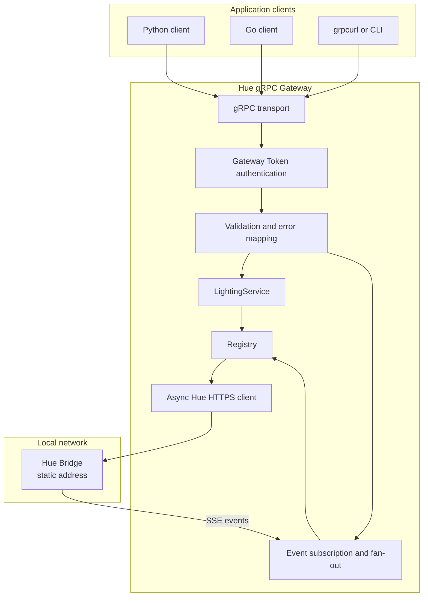
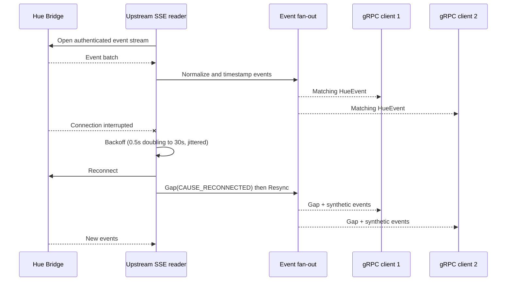
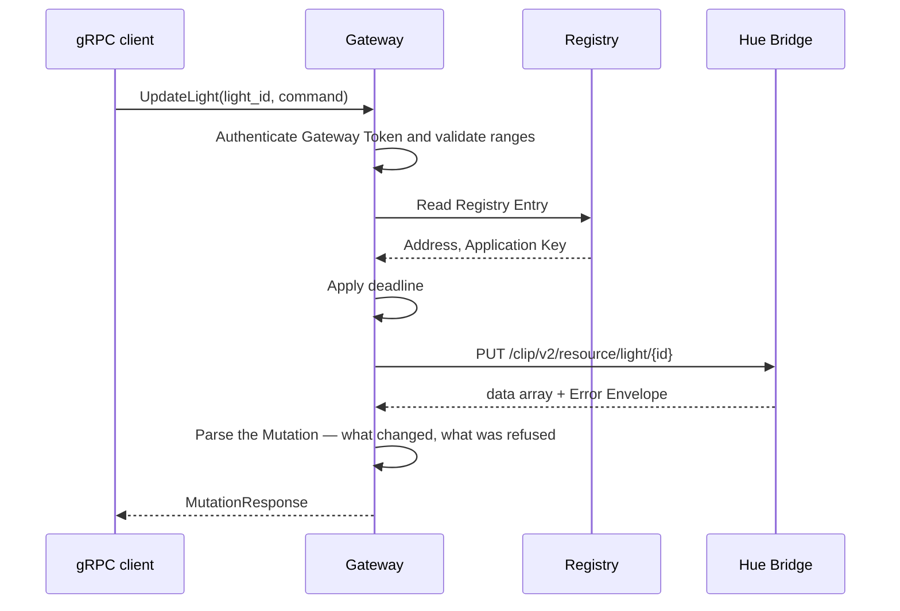
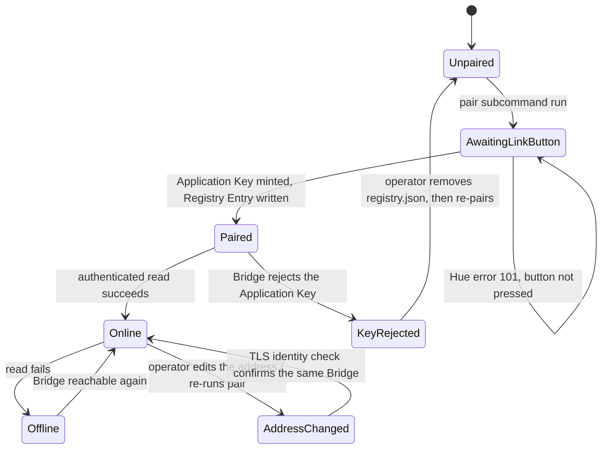
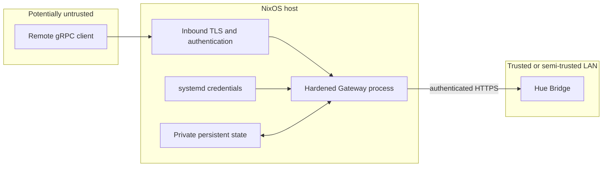
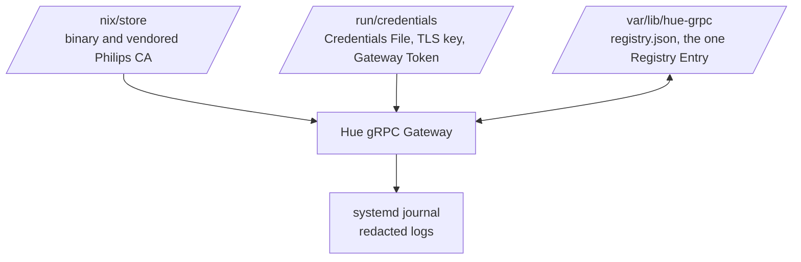
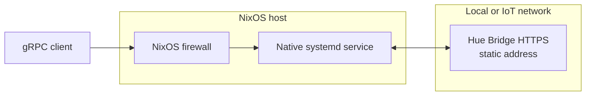
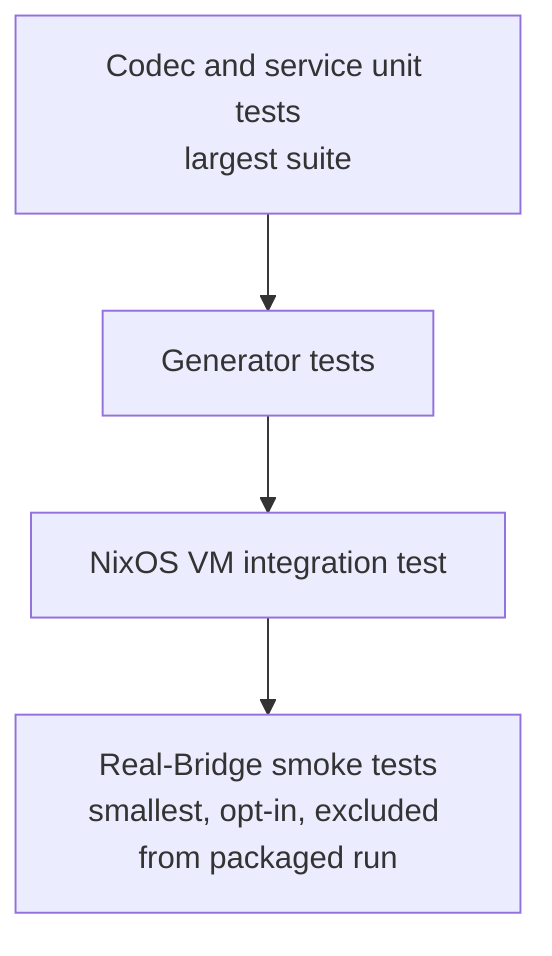
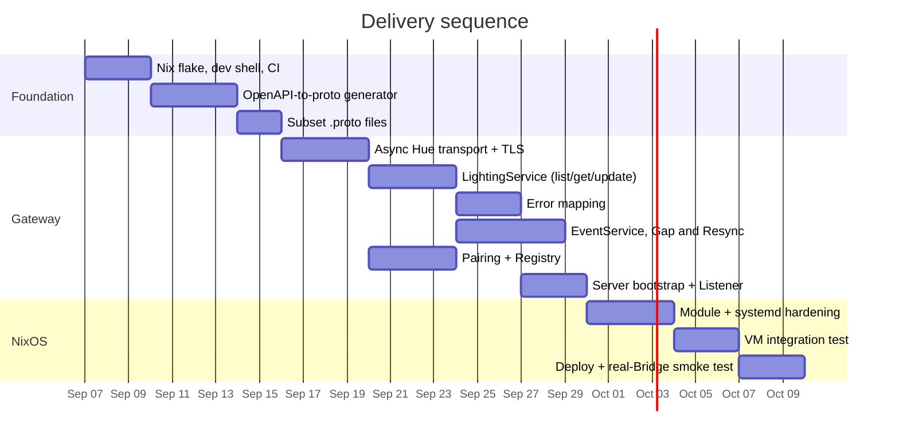

# Philips Hue API v2 gRPC Gateway on NixOS

## Project plan and technical design

**Status:** Proposed  
**Target platform:** NixOS  
**Implementation language:** Python 3.12 or newer  
**Primary upstream interface:** Philips Hue local CLIP v2 API, plus the v1 `POST /api` pairing call  
**Downstream interface:** gRPC with Protocol Buffers

---

## 1. Executive summary

This project creates a Python service — the Gateway — that exposes a small, fixed subset of the Philips Hue local CLIP v2 API through a typed gRPC API. The target is a service running natively on NixOS as a hardened systemd unit.

Five upstream paths are in scope, and no more:

| Purpose | Upstream call |
|---|---|
| Pairing | `POST /api` (v1) |
| List lights | `GET /clip/v2/resource/light` |
| Read one light | `GET /clip/v2/resource/light/{id}` |
| Update one light | `PUT /clip/v2/resource/light/{id}` |
| Event stream | `GET /eventstream/clip/v2` |

The Gateway will support:

- Pairing with one Bridge at a known address, minting and storing an Application Key.
- Typed `ListLights`, `GetLight`, and `UpdateLight` RPCs, with read/command models kept separate.
- A server-streaming `Subscribe` RPC over the Hue event stream, with an unconditional `Gap` and Resync on every reconnect.
- Structured translation of Hue errors into a stable gRPC contract, including partial-success Mutations.
- Reproducible Nix packaging, a development shell, a reusable NixOS module, and a NixOS VM integration test.

Everything else in the Hue API is out of scope: the rest of the CLIP v2 resource families, `create` and `delete` on any resource, mDNS and cloud discovery, multiple Bridges, the remote API, and Entertainment streaming. A raw compatibility RPC is described in §6.7 as a possible later escape hatch; it is not in the first release.

The service architecture itself is not NixOS-specific. NixOS primarily changes how the program is packaged, configured, secured, tested, and operated.

---

## 2. Goals

### 2.1 Functional goals

1. Expose the five in-scope Hue paths through gRPC: pairing, light list/get/update, and the event stream.
2. Provide a strongly typed protobuf model for the `light` resource and its command, keeping the readable and writable shapes separate.
3. Translate the Hue server-sent event stream into a gRPC server stream.
4. Pair with one Bridge at a configured address and remember it across restarts.
5. Preserve Hue-specific error information, including partial-success Mutations.
6. Remain usable when Hue adds fields to the `light` resource before the protobuf API is updated.

### 2.2 Operational goals

1. Run reproducibly on NixOS without mutable runtime package installation.
2. Start at boot and recover from transient failures under systemd.
3. Keep the three secrets — Application Key, Client Key, Gateway Token — out of the Nix store, process arguments, and logs.
4. Bind the Listener to loopback by default and require deliberate configuration for network exposure.
5. Provide health checks, structured logs, metrics, and graceful shutdown.
6. Support safe NixOS upgrades and rollbacks without losing the Registry Entry.

---

## 3. Non-goals for the first release

- Reimplementing the Bridge or its automation engine.
- Replacing the official Hue mobile application.
- Covering any CLIP v2 resource other than `light`.
- `create` or `delete` on any resource. The API is 84 GET / 39 PUT / 5 POST / 5 DELETE; `create` and `delete` exist on roughly five resources, none of them in scope.
- mDNS discovery, the Hue cloud discovery service, or support for more than one Bridge.
- Using the REST API for continuous, high-rate lighting effects.
- Automatically exposing the gRPC server to the public internet.
- Treating third-party OpenAPI descriptions as authoritative.
- Hiding differences between Bridge models or firmware versions.
- Providing transparent retries for Mutations whose outcome may be ambiguous.

The remote Hue API and the Hue Entertainment streaming protocol are each a separate workstream. Hue explicitly advises against using the ordinary REST API for continuous fast light updates and directs those use cases to its dedicated streaming API.

---

## 4. Scope definition

“All Hue endpoints” can refer to several related interfaces with different transports and security models. Only the local ones are relevant here, and only a slice of those.

| Interface | Transport | Disposition |
|---|---|---|
| `light` resource (list/get/update) | HTTPS/JSON, CLIP v2 | In scope |
| Hue event stream | HTTPS server-sent events, CLIP v2 | In scope |
| Pairing | Bridge HTTPS API, `POST /api` (v1) | In scope |
| Other CLIP v2 resource families | HTTPS/JSON | Out of scope |
| Bridge discovery (mDNS, cloud) | mDNS / HTTPS | Out of scope |
| Remote Hue API | HTTPS with OAuth | Separate workstream |
| Hue Entertainment streaming | Specialized real-time transport | Separate workstream |

### 4.1 First release boundary

The first release is the five paths above against one Bridge whose address is supplied as configuration or written by Pairing. Nothing else — additional resources, discovery, multiple Bridges, remote access, Entertainment — is in it.

### 4.2 Generator manifest

Because the scope is fixed at five paths, there is no coverage manifest to maintain and no "full coverage" milestone to chase. What the project does keep is `proto/manifest.toml`: the input to the OpenAPI-to-proto generator (see [ADR 0001](./docs/adr/0001-custom-openapi-to-proto-generator.md)), naming the schema roots each `.proto` file claims — `LightGet`, `LightPut`, `Event`, and the shared building blocks reached transitively.

The generator's input schema is OpenHue's vendored `openapi.yaml`, which is a seed and not authoritative. Field-level surprises are fixed against the real Bridge, in the generator, not by editing generated output.

---

## 5. High-level architecture



Pairing is a `hue-grpc-server pair` CLI subcommand, not a gRPC service; it writes the Registry the running Gateway reads.

### 5.1 Layer responsibilities

#### gRPC transport

- Hosts generated protobuf services using `grpc.aio`.
- Enforces inbound deadlines, message-size limits, and Gateway Token authentication.
- Provides standard gRPC health checking.
- Provides reflection on the loopback Listener, off otherwise unless overridden.
- Coordinates graceful shutdown.

#### Application services

- Implement `ListLights`, `GetLight`, `UpdateLight`, and `Subscribe`.
- Validate command numerical ranges before sending.
- Convert protobuf commands into Hue JSON, preserving field presence.
- Convert Hue resources and responses into protobuf messages.

#### Registry

- Holds the one Registry Entry: Bridge ID, address, model, firmware, last successful contact, Application Key, Client Key.
- One plaintext JSON file, mode 0600, replaced atomically. See [ADR 0004](./docs/adr/0004-registry-on-disk-format.md).
- A missing file means "not yet paired"; a damaged or wrong-version file is an error by name, never treated as empty.
- Follows the Bridge to a new address without a new Application Key, because the TLS identity check proves which Bridge answered.

#### Hue transport

- Speaks both APIs: Pairing is `POST /api` (v1), everything else is under `/clip/v2/`.
- Manages an asynchronous HTTPS connection pool to the one Bridge.
- Verifies the Bridge certificate per [ADR 0002](./docs/adr/0002-bridge-tls-verification.md): vendored root CA, `check_hostname=False`, explicit CN-equals-Bridge-ID check.
- Applies the `hue-application-key` header (the v1 API calls this field `username`; it is not one).
- Enforces timeouts and a configurable concurrency limit.
- Parses the Hue data/error Envelope.
- Maintains the upstream event-stream connection.

---

## 6. Proposed gRPC API

### 6.1 API organization

Two services, both small:

- `LightingService` — `ListLights`, `GetLight`, `UpdateLight`.
- `EventService` — `Subscribe`.

There is no `BridgeService`: Pairing is a CLI subcommand, and there is nothing to discover or select. A `RawHueService` is sketched in §6.7 as a possible later addition; it is not in the first release. Other resource families — rooms and zones, scenes, sensors, devices, connectivity, entertainment configuration, behavior automation — are out of scope entirely.

### 6.2 Package and versioning

Use a versioned protobuf namespace from the beginning:

```protobuf
package hue.v1;
```

Generated language packages should also be versioned. Once assigned, a field number is never changed or reused: assignments live in the committed `proto/field-numbers.json` lock file, keyed by the message's full nested path, and allocation takes `max + 1` rather than filling gaps. See [ADR 0003](./docs/adr/0003-committed-field-number-lock.md). Emitting `reserved` ranges for retired numbers is a known readability gap, not yet done; the lock file prevents reuse by construction.

### 6.3 Pairing

Pairing is not a gRPC service. It is a `hue-grpc-server pair` CLI subcommand:

```sh
hue-grpc-server pair --bridge-address 192.168.86.223 --bridge-id ECB5FAFFFE334703
```

It presses through `POST /api` (v1) within the thirty-second window after the physical link button, mints an Application Key (and a Client Key when asked), and writes the Registry Entry the running Gateway reads on its next start. Hue error type 101 ("link button not pressed") is an expected, retryable outcome, not a failure. Pairing again while an entry exists is refused: a second key would strand the first in the Bridge's app list.

Until an entry exists, the Gateway still starts and answers health and reflection, and answers every lighting call with `FAILED_PRECONDITION` telling the operator to run `pair`.

### 6.4 Lighting service

```protobuf
service LightingService {
  rpc ListLights(ListLightsRequest) returns (ListLightsResponse);
  rpc GetLight(GetLightRequest) returns (LightGet);
  rpc UpdateLight(UpdateLightRequest) returns (MutationResponse);
}
```

`LightGet` and `LightPut` are separate messages. A Light returned by the Bridge carries metadata, product data, geometry, and calculated state that have no place in a Command; a field absent from a `LightPut` is not part of the Command and never reaches the Bridge.

### 6.5 Protobuf modeling rules

- Use `optional` whenever omission differs from a default value.
- Use `oneof` for representations Hue rejects in combination — `LightPut` models `color` and `color_temperature` as a `oneof`, so "set both" is unrepresentable rather than something to validate and reject. (Unconfirmed against hardware; see `proto/manifest.toml`.)
- Give every enum an `UNSPECIFIED = 0` member.
- Use dedicated messages for UUID/resource references (`ResourceIdentifier`).
- Model XY color, color temperature, dimming, gradient points, effects, and duration explicitly.
- Use `google.protobuf.Timestamp` and `Duration` for semantic time values.
- Do not use `google.protobuf.Struct` as the normal representation for typed resources.
- Preserve truly unknown upstream data in a limited compatibility field where forward compatibility requires it.
- Validate numerical ranges before sending a Command to the Bridge.

Field presence is the whole contract. An omitted brightness or power field must not become zero or false when a Command is converted from protobuf to JSON — "leave the brightness alone" and "set the brightness to zero" are different Commands, and a Command that sets nothing is refused rather than sent.

### 6.6 Event service

```protobuf
service EventService {
  rpc Subscribe(SubscribeRequest) returns (stream HueEvent);
}
```

The request supports filters for:

- Resource type.
- Resource UUID.

There is no Bridge ID filter (there is one Bridge) and no raw-payload toggle (the raw payload is always carried).

Each `HueEvent` on the stream is one of:

- An **event**, carrying: Bridge ID; event and resource identifiers; event type; the Bridge's own creation timestamp; the Gateway's receive timestamp; a typed `LightGet` update when the resource is a Light; and the raw upstream payload for forward compatibility. Resources the Gateway does not model still arrive, with id and type and no typed update.
- A **`Gap`**, described below. It is a normal message on the stream, not an error or the end of it.

Synthetic Resync events (see below) are shaped exactly like Bridge events except that their `event_id` is empty and they carry no Bridge timestamp, because the Bridge never sent them.

#### Gap and Resync

The Gateway does not resume the event stream. `If-None-Match` and `Last-Event-ID` are parsed for nothing. Instead, **every reconnect emits a `Gap` with `cause = CAUSE_RECONNECTED` to every subscriber, unconditionally, whatever the outage's length**, immediately followed by a **Resync**: a full re-read of the light collection, diffed against what the Gateway last believed, published as ordinary synthetic events — an add, an update, or a delete. The Bridge purges its event buffer after several minutes without signalling that it has, so a Gap can never be disproven — only narrowed by Resync. See [ADR 0005](./docs/adr/0005-announce-every-gap-and-resync.md).

A subscriber's own queue overflow is announced the same way, with `cause = CAUSE_SUBSCRIBER_BEHIND` and a count of what was dropped, in the position the events would have occupied.



Maintain one upstream event connection and fan events out locally. Each subscriber has a bounded queue (`--event-queue-size`, 256 by default); a client that stops reading fills its own queue and is told what it missed with a `CAUSE_SUBSCRIBER_BEHIND` `Gap`. No client's deadline bounds the reconnect backoff — a Bridge unplugged overnight is still the Bridge. A slow gRPC client never blocks the Bridge event reader or its neighbours.

### 6.7 Raw compatibility service — not in the first release

A `RawHueService` is a plausible later escape hatch for endpoints Hue introduces that the typed services do not cover. It is **not** part of the first release and no proto for it exists. If it is ever added it must be disabled by default and, when enabled, restricted to trusted callers, accept only a known method and a relative path under an allow-listed prefix, reject traversal and alternate schemes, and apply the same authentication, deadlines, response limits, and log redaction as the typed services.

---

## 7. Request and response lifecycle



### 7.1 Deadlines

- Apply a reasonable default deadline to unary RPCs.
- Propagate the remaining gRPC deadline to the upstream HTTPS request.
- Keep connection and response timeouts distinct.
- Allow a longer deadline for the `pair` subcommand's link-button window.
- Cancel upstream work when the downstream gRPC call is cancelled.

### 7.2 Retries

- Retry a Safe Read only for clearly transient connection failures — three attempts total, so at most two retries, with a full-jitter backoff bounded well inside the caller's deadline.
- Never automatically retry a Mutation: a `PUT` that failed after the Bridge acted cannot be told apart from one that failed before.
- A Bridge that answered — a 429, a 503 — is not retried either; that is the client's decision.
- Reconnect the event stream on its own schedule, independent of unary RPC retry behavior.
- Avoid layered retry storms between gRPC clients, the Gateway, and the Bridge.

### 7.3 Concurrency and rate policy

- One configurable concurrency limit for the single Bridge.
- Return `RESOURCE_EXHAUSTED` when the local queue or configured policy rejects work, or when the Bridge itself asks to be left alone.
- Export queue depth, latency, rejection, and upstream-error metrics.

---

## 8. Error model

Hue can return errors inside an otherwise successful HTTP exchange, and a Mutation may report both successful and failed resource changes. Do not collapse the Hue Envelope into gRPC status alone.

```protobuf
message MutationResponse {
  repeated ResourceIdentifier updated = 1;  // what the Bridge says it changed
  repeated Error errors = 2;                // what it refused, in its own words
}

message Error {
  string description = 1;
}
```

`Error` is generated from the spec, which gives it only a `description`; a Bridge that reports more reaches clients with less. `updated` and `errors` can both be non-empty in one successful call — a Bridge that made one change and refused another reports both, so Hue's own errors travel in the `MutationResponse`, not as a gRPC status.

Wrapper-level mapping for everything that is not a normal Mutation. Local pre-flight failures are decided before the Gateway touches the Bridge; the rest are a round trip that failed, and there the gRPC status carries what the Bridge said along with it.

Local, before the Bridge is contacted:

| Condition | gRPC status |
|---|---|
| Invalid Command — out of range, or sets nothing | `INVALID_ARGUMENT` |
| Missing or invalid Gateway Token | `UNAUTHENTICATED` |
| Not yet paired (no Registry Entry) | `FAILED_PRECONDITION` |

After a round trip to the Bridge:

| Condition | gRPC status |
|---|---|
| Unknown light id | `NOT_FOUND` |
| Bridge rejects the Application Key | `FAILED_PRECONDITION` |
| Bridge unreachable | `UNAVAILABLE` |
| Bridge went quiet | `DEADLINE_EXCEEDED` |
| Bridge or local policy asks to back off | `RESOURCE_EXHAUSTED` |
| Bridge firmware does not serve the path | `UNIMPLEMENTED` |
| Unexpected Gateway failure | `INTERNAL` |

`FAILED_PRECONDITION` rather than `UNAUTHENTICATED` for a rejected Application Key is deliberate: `UNAUTHENTICATED` would send the caller after their Gateway Token, which is a different secret and not the problem.

Hue-originated application errors stay in the typed `MutationResponse` when the upstream request completed normally. Bridge transport and Gateway failures use gRPC status and may include structured status details.

---

## 9. Bridge address, Pairing, and Registration

There is no discovery. The Bridge's address is supplied — as `--bridge-address` / `bridge.address` configuration, or written by the `pair` subcommand — and the Gateway talks to exactly one Bridge. mDNS, `discovery.meethue.com`, UPnP, and any address-change-detection machinery are all out of scope.



There is no automatic recovery from a rejected Application Key: `pair` refuses to run while a Registry Entry exists, so an operator whose key was removed in the Hue app must delete `registry.json` (or the `bridge.credentialsFile`) by hand and pair again. This is deliberate — a Gateway that re-paired on its own would mint a second key and strand the first.

### 9.1 Bridge address policy

1. The address comes from `bridge.address` configuration, or from the Registry Entry the `pair` subcommand wrote. When `bridge.*` is set the Registry file is not read at all.
2. The Bridge is identified by its Bridge ID, asserted in its TLS certificate and checked on every connection ([ADR 0002](./docs/adr/0002-bridge-tls-verification.md)). This is what lets the Gateway follow the Bridge to a new address without re-Pairing.
3. Changing the address is an operator action — editing configuration or re-running `pair` — not something the Gateway detects.

### 9.2 Pairing and Registration policy

- Pairing is the `hue-grpc-server pair` subcommand: a deliberate CLI action taken next to the Bridge, within thirty seconds of the link-button press.
- The Application Key and Client Key are never logged.
- Registration — persisting the paired secrets into the Registry — happens atomically only after Pairing succeeds ([ADR 0004](./docs/adr/0004-registry-on-disk-format.md)). Pairing and Registration fail independently.
- Pairing again while a Registry Entry exists is refused: a second key would strand the first in the Bridge's app list, removable only with the Hue app.
- The Registry file is plaintext, mode 0600, outside the Nix store; a `cat`-able record is worth more here than encryption that would have to keep its key on the same disk.

### 9.3 What the Registry Entry records

Non-secret metadata: Bridge ID (normalised to uppercase), current address, Bridge model, firmware version, last successful contact time. Plus the two secrets Pairing minted: the Application Key and, when requested, the Client Key. Recording last contact rewrites the whole file, so it is coarse — after a reconnect, not after every request.

---

## 10. Security design

### 10.1 Trust boundaries



### 10.2 Outbound Hue security

The Bridge presents a certificate whose only identity is `CN=<bridge id>` (e.g. `CN=ecb5fafffe334703`), issued by `CN=root-bridge`, with **no** `subjectAltName`. Python's `ssl` module dropped CN fallback years ago, and the Gateway connects by IP anyway, so standard verification cannot work. The concrete approach ([ADR 0002](./docs/adr/0002-bridge-tls-verification.md)):

- Load Philips' `root-bridge` CA — **vendored into the repository**, because the Bridge serves only its leaf and the anchor never arrives over the wire — as the trust anchor, with `verify_mode = CERT_REQUIRED`.
- Set **`check_hostname = False`**.
- **Explicitly assert that the peer certificate's CN equals the expected Bridge ID** (casefolded), failing the connection otherwise. This assertion is not optional; it is what makes disabling hostname checking safe, and neither line may be removed without the other.
- `--bridge-ca-file` / `bridge.caFile` swaps the trust anchor for one the shipped CA cannot verify; the CN assertion still runs on top. There is no flag that turns the CN check or `CERT_REQUIRED` off.
- Verification must be in place before the first `POST /api` — Pairing is when the Bridge puts a new Application Key on the wire.
- Use HTTPS exclusively; add the `hue-application-key` header only inside the transport layer; redact it from traces and logs.
- The only outbound destination is the one configured Bridge address.

### 10.3 Inbound gRPC security

- Bind the Listener to `127.0.0.1` by default.
- A Listener beyond loopback is **refused** without both TLS and a Gateway Token — enforced at server startup and at NixOS build time, with no override. A TLS-terminating proxy on the same host talks to the loopback Listener.
- The Gateway Token is a single bearer token read from a file (`--gateway-token-file`), never a flag, because `ps` shows every argument to every user.
- Reflection follows the Listener: on for loopback, off otherwise, unless `--reflection on|off` overrides.
- Limit inbound and outbound message sizes.

### 10.4 Secret storage on NixOS

The three secrets — Application Key, Client Key (unused by CLIP v2), Gateway Token — plus any TLS private key, must never appear in:

- `configuration.nix` or `flake.nix`.
- Nix-generated static configuration.
- `ExecStart` arguments.
- Environment variables rendered by a Nix expression.

These can be copied into readable Nix store paths.

The only way a secret reaches the service:

- The **Credentials File** — `key=value` lines (`application-key`, optionally `client-key`) — named by `bridge.credentialsFile` and loaded through systemd `LoadCredential`, referenced by runtime path only. It can come from `sops-nix`, `agenix`, or a root-owned file under `/run/secrets`.
- The TLS private key and Gateway Token, likewise via `LoadCredential`.
- Or, when no Credentials File is set, the Registry Entry that the `pair` subcommand wrote under the state directory.

```text
--credentials-file /run/credentials/hue-grpc.service/bridge-keys
```

### 10.5 Pairing-generated secrets

When `pair` mints an Application Key it is written atomically, mode 0600, under the systemd `StateDirectory` (or `$XDG_STATE_HOME/hue-grpc` outside systemd). The Registry is **not encrypted at rest** ([ADR 0004](./docs/adr/0004-registry-on-disk-format.md)): with no external key store in the design, a decryption key would have to sit next to the ciphertext. The file lives outside the Nix store, so a NixOS rollback replaces the store without touching it.

---

## 11. NixOS packaging and deployment

### 11.1 Flake outputs

The repository should export:

```text
packages.default       Packaged hue-grpc-server executable
apps.default           Convenient `nix run` entry point
devShells.default      Development environment
nixosModules.default   Reusable NixOS service module
checks                 Unit tests, generator tests, lint, typecheck, VM test, package build
```

Pin `nixpkgs` through `flake.lock` to make the toolchain and dependency graph reproducible.

### 11.2 Python packaging

Use `python3Packages.buildPythonApplication` with a `pyproject.toml` build. Do not run `pip install`, create a virtual environment, or download dependencies during service startup.

Runtime dependencies (`pyproject.toml`):

- `grpcio`.
- `grpcio-health-checking` and `grpcio-reflection` — the standard health and reflection services the Listener serves.
- `protobuf`.
- `httpx` — the async HTTP client.

`grpcio-tools`, `pytest`, `ruff`, and `mypy` are dev-shell and check-environment only. No `zeroconf` — there is no discovery. Because `grpcio` includes compiled components, it comes from Nix rather than a precompiled wheel.

### 11.3 Protobuf generation

Python is generated from `proto/hue/v1/*.proto` into `src/hue/` on dev-shell entry and during the Nix build, and **that directory is gitignored** — the Python is made from the definitions every time rather than committed alongside them, so the two cannot drift ([ADR 0001](./docs/adr/0001-custom-openapi-to-proto-generator.md)). The `.proto` files themselves are generated from `openapi.yaml` by the project's own ~150-line generator, which emits `optional` on every non-required field and reads/writes `proto/field-numbers.json` for numbering stability ([ADR 0003](./docs/adr/0003-committed-field-number-lock.md)).

- Never generate code at service startup.
- The protobuf compiler and Python runtime are pinned together through `flake.lock`.
- Regenerate by hand with `./tools/generate-python-protos.sh`.

### 11.4 Proposed repository layout

```text
hue-grpc/
├── flake.nix
├── flake.lock
├── pyproject.toml
├── README.md
├── nix/
│   ├── package.nix
│   └── module.nix
├── openapi.yaml                  # OpenHue seed; generator input
├── proto/
│   ├── manifest.toml             # generator config
│   ├── field-numbers.json        # wire-number lock file (committed)
│   └── hue/v1/
│       ├── common.proto
│       ├── lighting.proto
│       ├── lighting_service.proto
│       ├── events.proto
│       └── event_service.proto
├── src/hue_grpc/
│   ├── cli.py                    # `pair` and `serve` subcommands
│   ├── serving/                  # gRPC transport, auth, health, shutdown
│   ├── lighting/                 # LightingService
│   ├── events/                   # Subscribe, fan-out, Gap/Resync
│   ├── hue/                      # async Hue HTTPS client, TLS verification
│   ├── registry.py              # paired Registry Entry (JSON file)
│   ├── static_registry.py       # `bridge.*` config path, no Registry file
│   └── codec.py                  # protobuf <-> Hue JSON
├── src/hue/                       # generated protobuf output (gitignored)
├── tools/
│   ├── protogen/                 # OpenAPI -> .proto generator
│   └── fake_hue/                 # fake Bridge for tests
├── tests/
│   ├── unit/
│   ├── protogen/
│   ├── fake_hue/
│   └── smoke/                    # real-Bridge, excluded from packaged run
└── scripts/
    └── deploy-and-smoke-test.sh
```

### 11.5 NixOS module interface

Expected user configuration:

```nix
{
  imports = [ hue-grpc.nixosModules.default ];

  services.hue-grpc = {
    enable = true;
    bridge = {
      address = "192.168.86.223";
      id = "ECB5FAFFFE334703";
      # `key=value` lines: application-key=..., optionally client-key=...
      credentialsFile = "/run/secrets/hue-grpc";
    };
  };
}
```

`bridge.*` describes one Bridge without Pairing or discovery. When it is set the Registry file is not read at all; leaving it unset falls back to a `registry.json` written by `hue-grpc-server pair` under the state directory.

Module options:

| Option | Purpose | Safe default |
|---|---|---|
| `services.hue-grpc.enable` | Enable the service | `false` |
| `services.hue-grpc.package` | Select package build | Flake default |
| `services.hue-grpc.listenAddress` | Listener bind address | `127.0.0.1` |
| `services.hue-grpc.port` | Listener port | `50051` |
| `services.hue-grpc.openFirewall` | Open inbound TCP port | `false` |
| `services.hue-grpc.bridge.address` | The one Bridge's address | unset |
| `services.hue-grpc.bridge.id` | The one Bridge's Bridge ID | unset |
| `services.hue-grpc.bridge.credentialsFile` | Credentials File (Application Key) | unset |
| `services.hue-grpc.bridge.caFile` | Trust anchor, replacing the vendored Philips CA | vendored |
| `services.hue-grpc.grpc.tls.enable` | Enable inbound TLS | off |
| `services.hue-grpc.grpc.tls.certificateFile` | TLS certificate | unset |
| `services.hue-grpc.grpc.tls.privateKeyFile` | TLS private key credential | unset |
| `services.hue-grpc.grpc.tokenFile` | Gateway Token file | unset |
| `services.hue-grpc.stateDirectory` | `StateDirectory` name for the Registry | `hue-grpc` |
| `services.hue-grpc.extraArgs` | Escape hatch: `--reflection`, `--log-level`, `--event-queue-size` | `[]` |

A non-loopback `listenAddress` is refused at build time without both `grpc.tls.enable` and `grpc.tokenFile` — the same rule the server enforces on startup. There is no discovery option and no raw-API option.

### 11.6 systemd service

The NixOS module should generate a hardened service similar to:

```nix
systemd.services.hue-grpc = {
  description = "Philips Hue gRPC gateway";
  wantedBy = [ "multi-user.target" ];
  after = [ "network-online.target" ];
  wants = [ "network-online.target" ];

  serviceConfig = {
    ExecStart = "${cfg.package}/bin/hue-grpc-server";
    Restart = "on-failure";
    RestartSec = "5s";

    DynamicUser = true;
    StateDirectory = cfg.stateDirectory;

    NoNewPrivileges = true;
    PrivateTmp = true;
    ProtectSystem = "strict";
    ProtectHome = true;
    ProtectKernelTunables = true;
    ProtectKernelModules = true;
    ProtectControlGroups = true;
  };
};
```

The rest of the sandbox — `SystemCallFilter=@system-service`, an empty `CapabilityBoundingSet`, `RestrictNamespaces`, `PrivateDevices`, `MemoryDenyWriteExecute`, and the other namespace and personality limits — is derived empirically against the booted VM: each directive is one the Gateway keeps working without, and the VM test runs `systemd-analyze security` on the live unit so the score cannot regress unnoticed. The hardening set must be exercised with Credentials File loading, certificate access, and persistent state — there is no mDNS to break.

### 11.7 Immutable and mutable data boundaries



The Registry lives outside the Nix store, so a package or system rollback replaces the store without touching it.

---

## 12. NixOS networking considerations

### 12.1 Native host deployment

Running directly as a native systemd service is recommended. The process needs:

- LAN access to the one Bridge over HTTPS.
- Inbound TCP access to the Listener port only when remote clients need it.

There is no multicast requirement: the Gateway does no mDNS and contacts no Hue cloud service.

### 12.2 IoT VLANs

If the Bridge sits on an IoT VLAN:

- Ensure routing permits Gateway-to-Bridge HTTPS to the configured address.
- Restrict the firewall to that address and port.
- Confirm return traffic and that the TLS identity check (CN equals Bridge ID) succeeds from where the Gateway runs.

A routed or segmented network needs no special handling here — the Bridge address is static configuration, which is the only mode.

### 12.3 Containers

NixOS containers and Docker-style containers add complications:

- Host networking reduces isolation.
- Secret and persistent-state mounts must be designed separately.

For this service, a hardened native systemd unit is preferable unless container isolation is a firm project requirement.



---

## 13. Configuration model

Separate non-secret configuration from the three secrets.

### 13.1 Non-secret configuration

- Listener address and port.
- TLS and Gateway Token modes.
- The one Bridge's address and Bridge ID.
- The trust anchor path (`bridge.caFile`), when overriding the vendored Philips CA.
- Timeouts and the concurrency limit.
- Event subscriber queue size.
- Reflection and log-level settings.

These are passed as command-line flags by the NixOS module.

### 13.2 Secret configuration

- The Application Key (and Client Key), via the Credentials File.
- The Gateway Token, via `--gateway-token-file`.
- The TLS private key, via `LoadCredential`.

No registry-encryption key exists: the Registry is not encrypted ([ADR 0004](./docs/adr/0004-registry-on-disk-format.md)). Flags refer to runtime paths, never to secret values.

### 13.3 Configuration precedence

1. Safe compiled defaults (loopback Listener, TLS off, no token, vendored CA).
2. Command-line flags from the NixOS module or the operator.
3. Runtime credential files for the three secrets.
4. Failing a Credentials File, the Registry Entry that `pair` wrote.

Secrets never come from environment variables.

---

## 14. Observability

### 14.1 Logs

Logs go to stderr, one JSON object per line (`--log-format text` for a person), carrying:

- Correlation ID — from the client's `x-correlation-id` metadata, minted otherwise.
- RPC service and method.
- gRPC status.
- Upstream HTTP status.
- Request duration and upstream duration.
- `Gap` cause on reconnect or subscriber overflow.

Never among them:

- The Application Key or the Gateway Token.
- The Client Key.
- The TLS private key or the Credentials File contents.
- The `POST /api` response, which carries the freshly minted key.

### 14.2 Metrics

- RPC count, status, and latency.
- Upstream request count, status, and latency.
- In-flight operation count against the Bridge.
- Subscriber queue depth and drops.
- Event-stream connection state and reconnect count.
- Event count by resource type.
- Subscriber count.
- Pairing successes and failures, without secrets.

Avoid high-cardinality labels such as arbitrary resource UUIDs unless a specific workload requires them.

### 14.3 Health and readiness

- Liveness: the process and gRPC runtime are operating.
- Readiness: the Gateway can accept calls, read its Registry, and reach its secrets.
- A Bridge that is unreachable does not make the Gateway unready — lighting calls return `UNAVAILABLE`, and the event stream keeps trying to reconnect.
- Set the standard gRPC health service to `NOT_SERVING` during graceful shutdown.

---

## 15. Testing strategy

### 15.1 Test pyramid



Unit tests are pure Python and run on macOS. The package targets `x86_64-linux`; the VM test runs in CI.

### 15.2 Unit tests

Test protobuf-to-Hue-JSON and Hue-JSON-to-protobuf conversion in `codec.py` independently of the network.

For `LightGet` and `LightPut`, cover:

- Complete `light` response.
- Minimal `light` response.
- Unknown enum or object fields from newer firmware.
- Omitted optional Command fields — and a Command that sets nothing, which is refused.
- Boundary numerical values (brightness beyond 100, mirek below 153).
- Malformed upstream data.
- The Hue data/error Envelope, including a Mutation that both changed and refused.

### 15.3 Generator tests

- The generator emits `optional` on every non-required field.
- `LightPut` models `color` / `color_temperature` as a `oneof`.
- Field numbers are read from and written back to `proto/field-numbers.json`, and an existing assignment is never changed.

### 15.4 Event tests

- Event parsing and batching.
- Filtering by resource type and resource ID.
- Multiple concurrent subscribers out of one upstream connection.
- Upstream disconnection and reconnection.
- `Gap(CAUSE_RECONNECTED)` on every reconnect, followed by Resync producing synthetic add/update/delete events.
- Slow subscriber: bounded queue, `Gap(CAUSE_SUBSCRIBER_BEHIND)` with a count, no effect on neighbours or the reader.
- Client cancellation.
- Gateway shutdown while streams are active.

### 15.5 NixOS VM test

`checks.integration-vm` (Linux only) boots three nodes:

- `bridge` — the fake Hue Bridge, presenting a leaf certificate of exactly the real shape under a CA it mints itself, so the whole TLS verification path runs for real.
- `gateway` — the module's unit with a static `bridge.*` and a Credentials File injected through `LoadCredential`.
- `paired` — the module's unit with no static Bridge, which runs the real `hue-grpc-server pair` subcommand against `bridge` in `ExecStartPre` and then reloads from the persisted `registry.json`.

The script:

1. Starts `hue-grpc.service` on `gateway` and verifies systemd health and the `systemd-analyze security` score.
2. Calls the standard gRPC health endpoint.
3. Exercises one read, one Mutation, and one event stream against `gateway`.
4. On `paired`: pairs against `bridge`, then restarts the service and confirms the Registry survived and a lighting call still works.
5. Confirms `gateway` recovers after a Bridge interruption, producing a `Gap` and Resync.
6. Greps the journal to confirm the Application Key is absent.

### 15.6 Real-Bridge smoke tests

`tests/smoke` talks to a real Bridge and is excluded from the packaged run. It is pointed at one by environment variable and gated in layers: `HUE_PRESS_LINK_BUTTON=1` for the test that mints an Application Key, `HUE_CHANGE_LIGHTS=1` for the one that writes to a light (it sets a light's brightness to the value it already has, so nothing visible happens).

`scripts/deploy-and-smoke-test.sh` is the same walk against real hardware end to end — pair, install the Credentials File, `nixos-rebuild switch`, read/change/restore one chosen light, prove an event arrives, prove a Bridge power-cycle produces a `Gap` and Resync, grep the journal — as a wizard that stops at every Mutation and records what the Bridge was and what it did. `--skip-deploy` drops the systemd half and runs the Gateway straight from `nix build`. The gap-and-resync step needs an interruption the Gateway can see — a Bridge reboot, not a pulled cable.

---

## 16. Development and CI workflow

### 16.1 Local development

The expected entry point is:

```bash
nix develop
```

The dev shell (`nix develop`) contains the pinned Python interpreter, `grpcio-tools`, `ruff`, `mypy`, and `pytest`, and compiles the `.proto` files into `src/hue/` on entry. Run `pytest` from inside it: the dev shell puts `src/` on `PYTHONPATH`, which `pyproject.toml` deliberately does not, so the Nix check phase exercises the installed package instead of the source tree.

```bash
nix flake check   # tests, lint, typecheck, package build, VM test
nix build         # ./result/bin/hue-grpc-server
```

### 16.2 Continuous integration

`nix flake check` runs in CI and covers:

- Nix flake evaluation and a reproducible package build.
- `ruff` and `mypy`.
- Unit tests and generator tests.
- The NixOS VM integration test (no fast native x86_64-linux builder is available locally, so this is CI-only).

Generated protobuf Python is not committed, so there is nothing for CI to check for drift — it is regenerated every build. Field-number stability is enforced by the committed `proto/field-numbers.json`, not by a CI compatibility check; a field changing type is a breaking change CI does not currently catch ([ADR 0003](./docs/adr/0003-committed-field-number-lock.md)).

### 16.3 Release artifacts

- Versioned source release with locked flake inputs.
- Nix package and NixOS module.
- Versioned `.proto` files and `proto/field-numbers.json`.
- Client-generation instructions.
- Migration notes for any protobuf or configuration change.

---

## 17. Implementation roadmap



Dates are illustrative; the dependencies are the point.

### Foundation

- `flake.nix`, locked inputs, dev shell, CI running `nix flake check`.
- The ~150-line OpenAPI-to-proto generator ([ADR 0001](./docs/adr/0001-custom-openapi-to-proto-generator.md)), the `proto/field-numbers.json` lock file ([ADR 0003](./docs/adr/0003-committed-field-number-lock.md)), and the subset `.proto` files it produces.

### Gateway

- Async Hue HTTPS client speaking both `POST /api` (v1) and `/clip/v2/`, with the [ADR 0002](./docs/adr/0002-bridge-tls-verification.md) certificate verification in place before the first Pairing call.
- `LightingService`: `ListLights`, `GetLight`, `UpdateLight`, with `LightGet`/`LightPut` kept separate and Command ranges validated before send.
- Error mapping: Hue Envelope parsed into the `MutationResponse`; transport failures into gRPC status carrying what the Bridge said.
- `EventService.Subscribe`: one upstream connection, per-subscriber bounded queues, unconditional `Gap` and Resync on every reconnect ([ADR 0005](./docs/adr/0005-announce-every-gap-and-resync.md)).
- `hue-grpc-server pair` and the plaintext JSON Registry ([ADR 0004](./docs/adr/0004-registry-on-disk-format.md)).
- Server bootstrap: Listener (loopback default, TLS + Gateway Token required beyond it), health, reflection, graceful shutdown.

### NixOS

- The module (`bridge.*`, `grpc.tls.*`, `grpc.tokenFile`) and the empirically derived systemd hardening set.
- `checks.integration-vm`, then `scripts/deploy-and-smoke-test.sh` against real hardware.

**Exit criterion:** a declaratively installed NixOS service pairs with a real Bridge, lists/reads/updates lights over gRPC, streams events with `Gap` and Resync, and keeps the Application Key out of the journal.

### Separate workstream — remote API

Out of scope. Would add OAuth registration and token lifecycle, a separate transport policy, and cloud-specific failure and rate-limit modelling.

### Separate workstream — Entertainment streaming

Out of scope. Would need study of the dedicated Entertainment protocol, its latency and flow-control behaviour over gRPC, and explicit session ownership semantics — not modelled as ordinary REST Mutations.

---

## 18. Risks and mitigations

| Risk | Impact | Mitigation |
|---|---|---|
| OpenHue's schema differs from real Bridge behaviour | Incorrect proto schema | Treat `openapi.yaml` as a seed; fix field-level surprises against the real Bridge, in the generator |
| A generic generator flattens proto3 field presence | "leave the light alone" and "turn it off" identical on the wire | Own the generator; emit `optional` on every non-required field; exhaustive omission tests ([ADR 0001](./docs/adr/0001-custom-openapi-to-proto-generator.md)) |
| A Mutation is retried after an ambiguous failure | Duplicate or unexpected light changes | Never retry a Mutation automatically; validate ranges before send |
| An upstream property insertion shifts every field number | Silent wire incompatibility with deployed clients | `proto/field-numbers.json` lock file; `max + 1` allocation; assignments never changed ([ADR 0003](./docs/adr/0003-committed-field-number-lock.md)) |
| A slow gRPC subscriber stalls the Bridge event reader | Event loss for everyone | Bounded per-subscriber queues; `Gap(CAUSE_SUBSCRIBER_BEHIND)`; the reader never waits ([ADR 0005](./docs/adr/0005-announce-every-gap-and-resync.md)) |
| A resumed event stream looks complete but isn't | Client believes a guarantee the Bridge cannot give | Do not resume; announce a `Gap` on every reconnect and follow it with a Resync |
| `check_hostname=False` read as a security bug and removed | Any Philips-signed Bridge accepted | The CN-equals-Bridge-ID assertion immediately follows it; ADR 0002 documents that neither line stands alone |
| The Application Key leaks into `/nix/store` or the journal | Bridge compromise | Credentials File via `LoadCredential`; Registry outside the store at 0600; VM test greps the journal |
| systemd hardening blocks credentials or state | Service fails after deployment | Hardening derived empirically against the booted VM; `systemd-analyze security` gate |
| A new Hue field is unknown to the proto | `light` data fidelity loss | Every event carries its raw payload; generator regenerated from the updated spec |
| An unreadable Registry treated as "nothing registered" | Gateway re-Pairs, stranding a key in the Bridge's app list | `UnreadableRegistryError` / `UnsupportedRegistryVersionError`; only a missing file means unpaired ([ADR 0004](./docs/adr/0004-registry-on-disk-format.md)) |
| The Listener is exposed beyond loopback unintentionally | Unauthorized lighting control | Loopback default; a non-loopback bind is refused without both TLS and a Gateway Token, at build time and at startup |
| A NixOS rollback discards the Registry | A walk to the Bridge and a button press to recover | Registry lives under `StateDirectory`, outside the store; directory `fsync` on write |

---

## 19. Definition of done

The first release is done when:

- All five in-scope paths work end to end: Pairing (`POST /api`), `ListLights`, `GetLight`, `UpdateLight`, and `Subscribe`.
- `LightGet` and `LightPut` have bidirectional conversion tests: complete and minimal responses, unknown fields, omitted Command fields, boundary values, malformed data, and the Hue Envelope.
- A Command that would set nothing, or set a value outside Hue's documented range, is refused before anything is sent.
- A Mutation reports what the Bridge changed and what it refused in the same `MutationResponse`; transport failures return a gRPC status carrying what the Bridge said.
- Every reconnect emits a `Gap` followed by a Resync; a subscriber's own overflow emits a `Gap` with a count.
- Not being paired yields `FAILED_PRECONDITION`, not a crash; a rejected Application Key yields `FAILED_PRECONDITION`, not `UNAUTHENTICATED`.
- Field numbers are locked in `proto/field-numbers.json` and never reassigned.
- The Nix package builds from locked inputs with no runtime dependency downloads; generated protobuf Python is never committed.
- The NixOS module starts, stops, restarts, and upgrades the service safely, and a non-loopback Listener is refused without TLS and a Gateway Token.
- The three secrets are absent from the Nix store, command arguments, and the journal.
- The Registry survives service restarts and system rollbacks.
- `checks.integration-vm` passes, and `scripts/deploy-and-smoke-test.sh` has been run against at least one real Bridge with its model and firmware recorded.
- Deployment, security, and client-generation documentation is complete.

Anything beyond the five paths — other resource families, `create`/`delete`, discovery, multiple Bridges, the raw service, the remote API, Entertainment — is explicitly not part of this definition.

---

## 20. Immediate next steps

1. Flake outputs, dev shell, and CI.
2. The OpenAPI-to-proto generator and `proto/field-numbers.json`, seeded from the vendored `openapi.yaml`.
3. The subset `.proto` files: `common.proto`, `lighting.proto`, `lighting_service.proto`, `events.proto`, `event_service.proto`.
4. The async Hue transport, with [ADR 0002](./docs/adr/0002-bridge-tls-verification.md) certificate verification, speaking `POST /api` and `/clip/v2/`.
5. `LightingService`, error mapping, then `EventService` with `Gap` and Resync.
6. `pair` and the Registry, then the server bootstrap and Listener.
7. The fake Bridge, the NixOS module, and `checks.integration-vm`.
8. `scripts/deploy-and-smoke-test.sh` against real hardware.

---

## 21. References

- [Philips Hue API v2 reference](https://developers.meethue.com/develop/hue-api-v2/api-reference/)
- [Philips Hue developer news and API change notices](https://developers.meethue.com/)
- [Philips Hue getting started guide](https://developers.meethue.com/develop/get-started-2/)
- [OpenHue community OpenAPI specification](https://github.com/openhue/openhue-api)
- [`CONTEXT.md`](./CONTEXT.md) — the project's vocabulary
- [`docs/adr/`](./docs/adr) — the decisions that are hard to reverse
- [gRPC Python documentation](https://grpc.io/docs/languages/python/)
- [gRPC Python basics](https://grpc.io/docs/languages/python/basics/)
- [gRPC health checking](https://grpc.io/docs/guides/health-checking/)
- [gRPC reflection](https://grpc.io/docs/guides/reflection/)
- [gRPC retry guidance](https://grpc.io/docs/guides/retry/)
- [gRPC interceptor guidance](https://grpc.io/docs/guides/interceptors/)
- [NixOS manual](https://nixos.org/manual/nixos/stable/)
- [NixOS Python packaging guidance](https://wiki.nixos.org/wiki/Python)
- [NixOS systemd hardening guidance](https://wiki.nixos.org/wiki/Systemd/Hardening)

---

## 22. Decisions and where they are recorded

The choices that were open in earlier drafts have since been made, several of them while stress-testing this plan:

| Question | Decision | Recorded in |
|---|---|---|
| First release scope | Local-only, one Bridge, five paths | This document; `README.md` |
| Raw unknown fields in events | Always carried, not toggle-gated | §6.6 |
| Registry encryption at rest | No — no external key store to make it meaningful | [ADR 0004](./docs/adr/0004-registry-on-disk-format.md) |
| Remote gRPC client auth | Single bearer Gateway Token from a file; TLS required beyond loopback | §10.3 |
| Reflection on non-loopback Listeners | Off by default, `--reflection` overrides | §10.3 |
| Slow event subscribers | Bounded queue, `Gap(CAUSE_SUBSCRIBER_BEHIND)` with a count | [ADR 0005](./docs/adr/0005-announce-every-gap-and-resync.md) |
| Raw service | Not in the first release | §6.7 |
| Generated protobuf Python | Build-generated, gitignored | [ADR 0001](./docs/adr/0001-custom-openapi-to-proto-generator.md) |
| Field numbering | Committed lock file, never reassigned | [ADR 0003](./docs/adr/0003-committed-field-number-lock.md) |
| Bridge certificate verification | Vendored root CA, `check_hostname=False`, explicit CN check | [ADR 0002](./docs/adr/0002-bridge-tls-verification.md) |
| Discovery | None — static Bridge address only | §9 |
| Supported compatibility matrix | Recorded per real-Bridge smoke run, not fixed up front | §15.6 |

