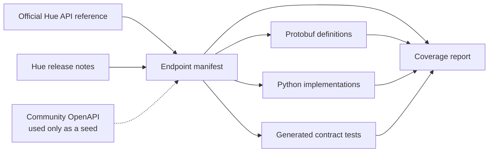
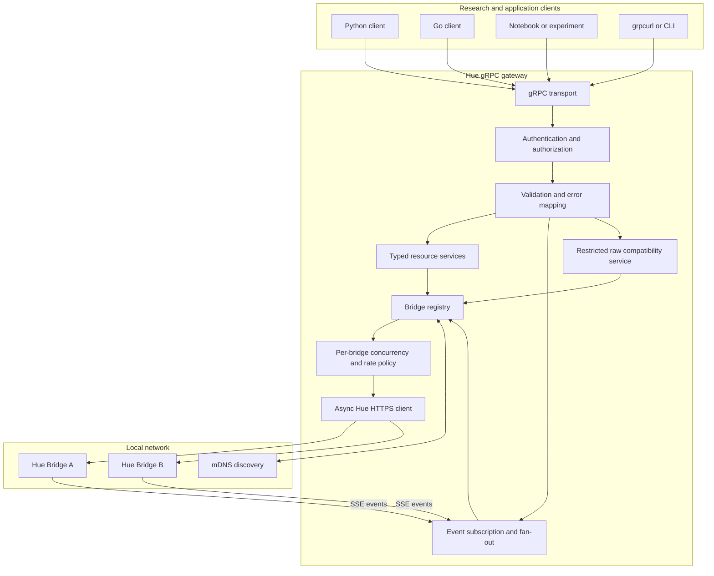
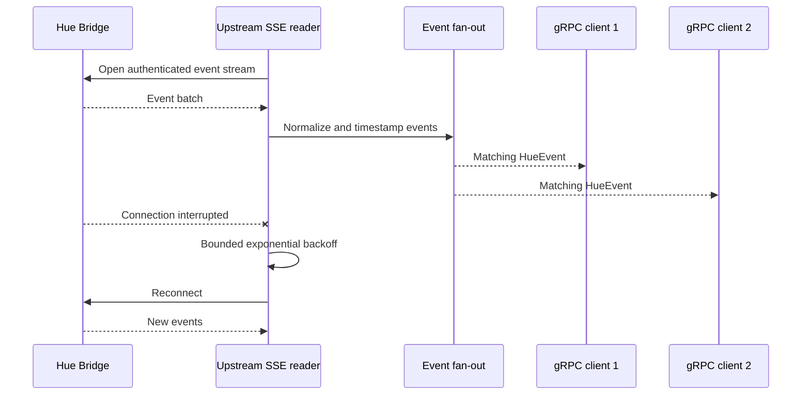
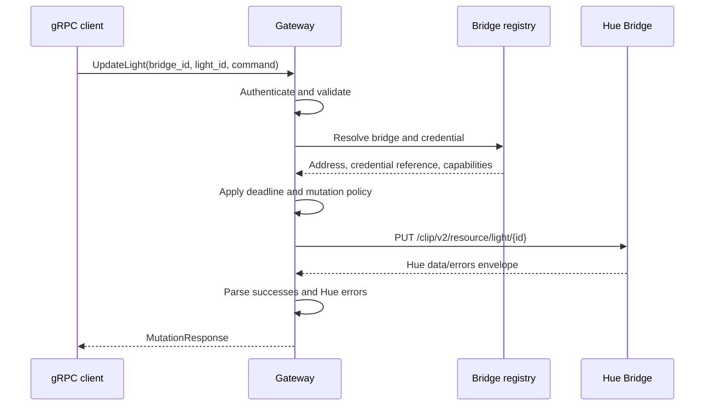
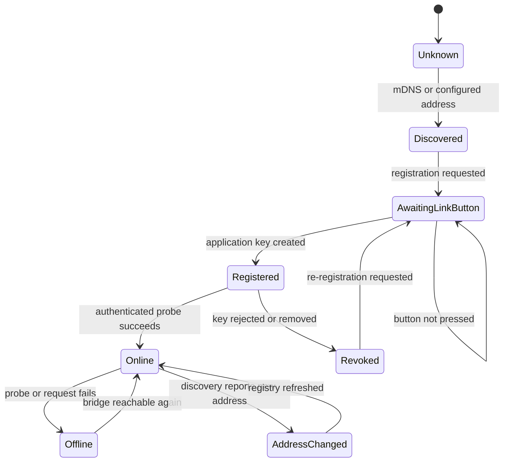
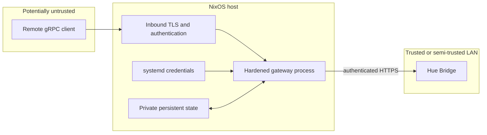
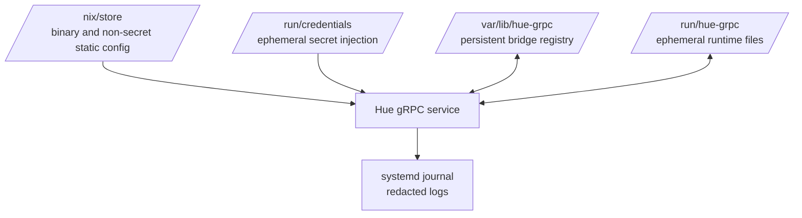
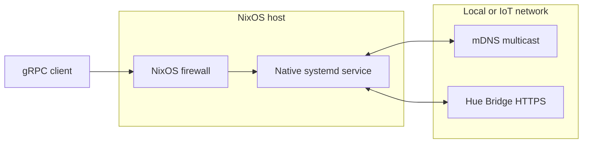
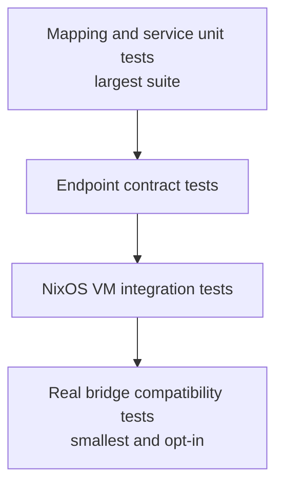
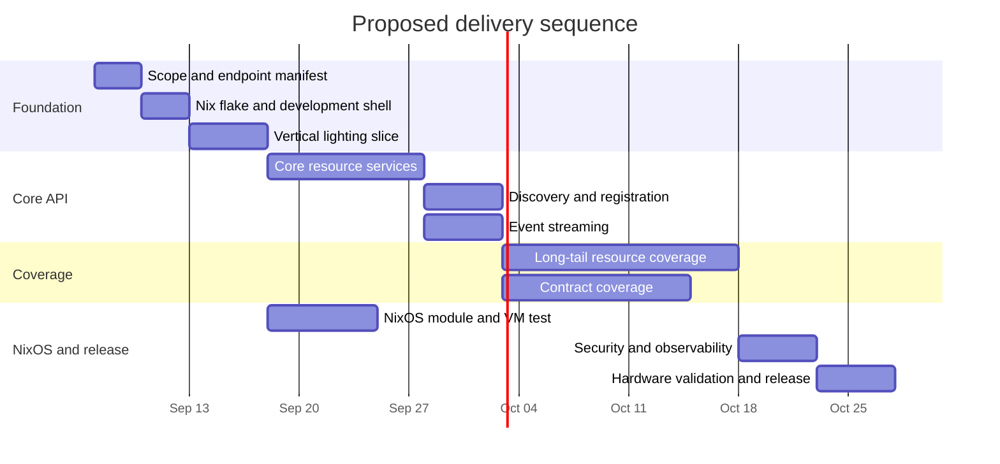

# Philips Hue API v2 gRPC Gateway on NixOS

## Project plan and technical design

**Status:** Proposed  
**Target platform:** NixOS  
**Implementation language:** Python 3.12 or newer  
**Primary upstream interface:** Philips Hue local API v2  
**Downstream interface:** gRPC with Protocol Buffers

---

## 1. Executive summary

This project will create a Python service that wraps the Philips Hue API v2 and exposes its capabilities through a typed gRPC API. The initial target is a service running natively on NixOS as a hardened systemd unit.

The gateway will support:

- Local Hue Bridge discovery.
- Link-button application registration.
- Secure storage and use of Hue application keys.
- Typed read, create, update, and delete operations for API v2 resources.
- Server-streaming gRPC access to the Hue event stream.
- Multiple Hue Bridges.
- Structured translation of Hue errors into a stable gRPC contract.
- A restricted raw compatibility RPC for newly introduced Hue endpoints.
- Reproducible Nix packaging, a development shell, a reusable NixOS module, and NixOS integration tests.

The project should not treat “all endpoints” as an informal aspiration. An endpoint manifest will enumerate every upstream Hue endpoint, its supported operations, its corresponding RPCs, and its test status. Full coverage is achieved only when this manifest has been verified against the official API reference and every included endpoint has an implementation or a documented exception.

The service architecture itself is not NixOS-specific. NixOS primarily changes how the program is packaged, configured, secured, tested, and operated.

---

## 2. Goals

### 2.1 Functional goals

1. Expose the complete selected scope of Philips Hue API v2 through gRPC.
2. Provide a strongly typed protobuf model for stable Hue resources and commands.
3. Translate the Hue server-sent event stream into a gRPC server stream.
4. Support discovery, registration, and management of multiple bridges.
5. Preserve Hue-specific error information, including partial-success responses.
6. Remain usable when Hue adds fields or endpoints before the protobuf API is updated.
7. Make API coverage measurable and automatically testable.

### 2.2 Operational goals

1. Run reproducibly on NixOS without mutable runtime package installation.
2. Start at boot and recover from transient failures under systemd.
3. Keep credentials out of the Nix store, process arguments, and logs.
4. Bind to loopback by default and require deliberate configuration for network exposure.
5. Provide health checks, structured logs, metrics, and graceful shutdown.
6. Support safe NixOS upgrades and rollbacks without losing bridge registrations.

### 2.3 Research goals

1. Make raw Hue semantics observable without coupling researchers to HTTP details.
2. Preserve event timestamps, resource identifiers, error details, and upstream timing.
3. Make experimental features accessible through an explicitly unstable compatibility API.
4. Record the bridge firmware and observed API capabilities alongside experiment data.

---

## 3. Non-goals for the first release

- Reimplementing the Hue Bridge or its automation engine.
- Replacing the official Hue mobile application.
- Using the REST API for continuous, high-rate lighting effects.
- Automatically exposing the gRPC server to the public internet.
- Treating third-party OpenAPI descriptions as authoritative.
- Hiding differences between bridge models or firmware versions.
- Providing transparent retries for mutations whose outcome may be ambiguous.

The Hue Entertainment streaming protocol should be evaluated as a separate workstream. Hue explicitly advises against using the ordinary REST API for continuous fast light updates and directs those use cases to its dedicated streaming API.

---

## 4. Scope definition

“All Hue endpoints” can refer to several related interfaces with different transports and security models.

| Interface | Transport | Initial disposition |
|---|---|---|
| Local Hue API v2 resources | HTTPS/JSON | In scope |
| Hue event stream | HTTPS server-sent events | In scope |
| Bridge discovery | mDNS and optional Hue discovery service | In scope |
| Link-button registration | Bridge HTTPS API | In scope |
| Remote Hue API | HTTPS with OAuth | Later phase |
| Hue Entertainment streaming | Specialized real-time transport | Separate workstream |

### 4.1 Recommended first release boundary

The first stable release should include the complete local resource API, discovery, registration, and local event streaming. Remote/cloud access and Entertainment streaming should not delay the local gateway.

### 4.2 Endpoint manifest

The project will maintain a machine-readable manifest such as:

```yaml
- hue_path: /clip/v2/resource/light
  methods: [GET]
  grpc_service: LightingService
  grpc_methods: [ListLights]
  status: implemented
  tests:
    mapping: true
    contract: true
    hardware: true

- hue_path: /clip/v2/resource/light/{id}
  methods: [GET, PUT]
  grpc_service: LightingService
  grpc_methods: [GetLight, UpdateLight]
  status: implemented
  tests:
    mapping: true
    contract: true
    hardware: true
```

Each entry should record:

- Upstream path and HTTP methods.
- Official documentation revision or verification date.
- Minimum known bridge/API or firmware requirement.
- Read, create, mutation, or deletion semantics.
- Request and response schemas.
- Resource references and capability dependencies.
- Event types associated with the resource.
- Corresponding protobuf service and RPC names.
- Implementation status.
- Unit, contract, emulator, and hardware test status.
- Known deviations or unsupported behavior.



The community-maintained OpenHue specification can accelerate initial inventory work, but every endpoint and field must be checked against the authenticated official Hue API reference.

---

## 5. High-level architecture



### 5.1 Layer responsibilities

#### gRPC transport

- Hosts generated protobuf services using `grpc.aio`.
- Enforces inbound deadlines, message-size limits, and authentication.
- Provides standard gRPC health checking.
- Provides reflection in development and optionally in trusted deployments.
- Coordinates graceful shutdown.

#### Application services

- Implement domain-level RPC behavior.
- Validate capability-dependent operations.
- Select a configured bridge.
- Convert protobuf commands into Hue JSON.
- Convert Hue resources and responses into protobuf messages.

#### Bridge registry

- Tracks bridge IDs, addresses, firmware versions, capabilities, and credential references.
- Supports static and discovered bridge addresses.
- Persists registration information without exposing secret material in logs.
- Detects address changes and refreshes bridge metadata.

#### Hue transport

- Manages asynchronous HTTPS connection pools per bridge.
- Applies the `hue-application-key` header.
- Enforces timeouts and configurable concurrency limits.
- Parses Hue data/error envelopes.
- Maintains upstream event-stream connections.

---

## 6. Proposed gRPC API

### 6.1 API organization

Use domain-oriented services instead of one very large service:

- `BridgeService`
- `LightingService`
- `RoomZoneService`
- `SceneService`
- `SensorService`
- `DeviceService`
- `ConnectivityService`
- `EntertainmentConfigurationService`
- `AutomationService`
- `SmartHomeIntegrationService`
- `EventService`
- `RawHueService`

The exact service inventory should follow the verified endpoint manifest. Resource families currently visible in Hue and OpenHue materials include lighting, rooms and zones, scenes, sensors, devices, connectivity, entertainment configuration, behavior automation, Matter/HomeKit integration, software updates, and newer motion-area or switch-input features.

### 6.2 Package and versioning

Use a versioned protobuf namespace from the beginning:

```protobuf
package hue.v1;
```

Generated language packages should also be versioned. Once published, field numbers must never be reused. Removed fields and enum values should be marked `reserved`.

### 6.3 Bridge management service

```protobuf
service BridgeService {
  rpc DiscoverBridges(DiscoverBridgesRequest)
      returns (stream DiscoveredBridge);

  rpc RegisterApplication(RegisterApplicationRequest)
      returns (RegisterApplicationResponse);

  rpc ListBridges(ListBridgesRequest)
      returns (ListBridgesResponse);

  rpc GetBridgeStatus(GetBridgeStatusRequest)
      returns (BridgeStatus);

  rpc RefreshBridgeMetadata(RefreshBridgeMetadataRequest)
      returns (BridgeStatus);
}
```

Registration must model “link button not pressed” as an expected recoverable outcome, not as an internal server failure.

### 6.4 Typed resource services

Typical lighting RPCs might look like:

```protobuf
service LightingService {
  rpc ListLights(ListLightsRequest) returns (ListLightsResponse);
  rpc GetLight(GetLightRequest) returns (Light);
  rpc UpdateLight(UpdateLightRequest) returns (MutationResponse);

  rpc ListGroupedLights(ListGroupedLightsRequest)
      returns (ListGroupedLightsResponse);
  rpc GetGroupedLight(GetGroupedLightRequest)
      returns (GroupedLight);
  rpc UpdateGroupedLight(UpdateGroupedLightRequest)
      returns (MutationResponse);
}
```

Use separate models for readable resource state and writable commands. A resource returned by Hue can contain metadata, capabilities, calculated state, and other read-only fields that do not belong in an update request.

### 6.5 Protobuf modeling rules

- Use `optional` whenever omission differs from a default value.
- Use `oneof` for mutually exclusive representations.
- Give every enum an `UNSPECIFIED = 0` member.
- Use dedicated messages for UUID/resource references.
- Model XY color, color temperature, dimming, gradient points, effects, and duration explicitly.
- Use `google.protobuf.Timestamp` and `Duration` for semantic time values.
- Do not use `google.protobuf.Struct` as the normal representation for typed resources.
- Preserve truly unknown upstream data in a limited compatibility field where research fidelity requires it.
- Validate numerical ranges before sending commands to a bridge.
- Preserve resource capability information so clients can determine which commands are supported.

Field presence is particularly important. An omitted brightness or power field must not accidentally become zero or false when converted from protobuf to JSON.

### 6.6 Event service

```protobuf
service EventService {
  rpc Subscribe(SubscribeRequest) returns (stream HueEvent);
}
```

The request should support filters for:

- Bridge ID.
- Hue resource type.
- Resource UUID.
- Event category, where meaningful.
- Inclusion of raw upstream payloads.

The returned event should include:

- Bridge ID.
- Event and resource identifiers.
- Event type.
- Hue creation timestamp.
- Gateway receive timestamp.
- Typed resource update when known.
- Optional raw payload for forward compatibility.
- A flag indicating whether events may have been dropped for this subscriber.



Maintain one upstream event connection per bridge and fan events out locally. Each subscriber needs a bounded queue. Define whether a slow consumer is disconnected, skips older events, or receives an explicit gap marker. Never permit a slow gRPC client to block the bridge event reader.

### 6.7 Raw compatibility service

```protobuf
service RawHueService {
  rpc Call(RawHueRequest) returns (RawHueResponse);
}
```

This service is an escape hatch for newly introduced endpoints and research experiments. It should be clearly marked unstable and restricted to trusted callers.

Security constraints:

- Accept a registered bridge ID, never an arbitrary host or URL.
- Accept only known HTTP methods.
- Require a relative path under an allow-listed Hue API prefix.
- Reject path traversal and alternate schemes.
- Apply the same authentication, deadlines, response limits, and logging redaction as typed services.
- Allow administrators to disable the service entirely.

---

## 7. Request and response lifecycle



### 7.1 Deadlines

- Require or apply reasonable default deadlines for unary RPCs.
- Propagate the remaining gRPC deadline to the upstream HTTPS request.
- Keep connection and response timeouts distinct.
- Allow longer deadlines for registration and discovery.
- Cancel upstream work when the downstream gRPC call is cancelled.

### 7.2 Retries

- Retry safe reads only for clearly transient connection failures.
- Use bounded exponential backoff with jitter.
- Do not automatically retry a mutation after an ambiguous upstream failure.
- Reconnect event streams independently of unary RPC retry behavior.
- Avoid layered retry storms between gRPC clients, the gateway, and the bridge.

### 7.3 Concurrency and rate policy

- Maintain independent concurrency controls for each bridge.
- Make limits configurable because bridge models and workloads vary.
- Separate read and mutation limits if testing shows a benefit.
- Return `RESOURCE_EXHAUSTED` when the local queue or configured policy rejects work.
- Export queue depth, latency, rejection, and upstream-error metrics.

---

## 8. Error model

Hue can return errors inside an otherwise successful HTTP exchange, and some operations may report both successful and failed resource changes. Do not collapse the Hue envelope into gRPC status alone.

```protobuf
message MutationResponse {
  repeated ResourceIdentifier updated = 1;
  repeated HueError errors = 2;
}

message HueError {
  optional int32 type = 1;
  string address = 2;
  string description = 3;
  optional bytes raw_json = 4;
}
```

Recommended wrapper-level mapping:

| Condition | gRPC status |
|---|---|
| Invalid protobuf request | `INVALID_ARGUMENT` |
| Unknown configured bridge or resource | `NOT_FOUND` |
| Missing or invalid gateway credentials | `UNAUTHENTICATED` |
| Caller lacks permission | `PERMISSION_DENIED` |
| Bridge unreachable | `UNAVAILABLE` |
| Deadline expired | `DEADLINE_EXCEEDED` |
| Queue or rate policy exhausted | `RESOURCE_EXHAUSTED` |
| Unsupported gateway feature | `UNIMPLEMENTED` |
| Unexpected gateway failure | `INTERNAL` |

Hue-originated application errors should remain in typed responses when the upstream request completed normally. Bridge transport or gateway failures should use gRPC status and may include structured status details.

---

## 9. Discovery, registration, and bridge lifecycle

Hue recommends mDNS and its discovery service rather than deprecated UPnP discovery.



### 9.1 Discovery policy

1. Prefer explicitly configured bridge addresses when present.
2. Use mDNS for normal automatic local discovery.
3. Optionally use `discovery.meethue.com` as a fallback when permitted.
4. Identify bridges by their stable bridge identity, not their IP address.
5. Refresh addresses without discarding credentials.

### 9.2 Registration policy

- Require a deliberate administrative RPC or CLI action.
- Restrict registration to trusted local or authenticated clients.
- Never log returned application keys.
- Return a clear retryable status when the physical button has not been pressed.
- Persist the credential atomically only after successful registration.
- Provide secure export/import operations for backup and migration.

### 9.3 Capability tracking

Store non-secret metadata including:

- Bridge identity and friendly name.
- Current address and discovery source.
- Bridge model and firmware version.
- Last successful contact time.
- Observed resource types.
- API features required by the endpoint manifest.

This allows research output to record the exact environment that produced an observation.

---

## 10. Security design

### 10.1 Trust boundaries



### 10.2 Outbound Hue security

- Use HTTPS exclusively.
- Follow Hue’s current certificate-validation guidance.
- Never make disabled certificate validation the default.
- Add the application key only inside the transport layer.
- Redact authorization headers and credentials from traces and logs.
- Restrict bridge destinations to registered or discovered bridge addresses.

### 10.3 Inbound gRPC security

- Bind to `127.0.0.1` by default.
- Require TLS when listening beyond loopback.
- Support bearer-token authentication or mutual TLS for shared deployments.
- Apply authorization rules separately to registration, raw calls, reads, and mutations.
- Disable reflection on untrusted public listeners unless explicitly required.
- Limit inbound and outbound message sizes.

### 10.4 Secret storage on NixOS

Never place Hue application keys, bearer tokens, or TLS private keys directly in:

- `configuration.nix`.
- `flake.nix`.
- Nix-generated static configuration.
- `ExecStart` arguments.
- Environment variables rendered by a Nix expression.

These values can be copied into world-readable or broadly readable Nix store paths.

Preferred mechanisms:

- systemd credentials using `LoadCredential`.
- `sops-nix`.
- `agenix`.
- A root-owned file under `/run/secrets`.
- A bridge key generated by the service and stored with owner-only access in its state directory.

The service should accept credential file descriptors or paths such as:

```text
--credentials-file /run/credentials/hue-grpc.service/bridge-keys
```

### 10.5 Pairing-generated secrets

If the gRPC registration API creates a Hue application key dynamically:

- Write it atomically.
- Set owner-only permissions.
- Keep it under the systemd-managed state directory.
- Consider encrypting the bridge registry at rest.
- Provide a safe backup/export path.
- Ensure a NixOS rollback does not overwrite or discard it.

---

## 11. NixOS packaging and deployment

### 11.1 Flake outputs

The repository should export:

```text
packages.default       Packaged gateway executable
apps.default           Convenient `nix run` entry point
devShells.default      Development environment
nixosModules.default   Reusable NixOS service module
checks                  Tests, linting, proto checks, package build
```

Pin `nixpkgs` through `flake.lock` to make the toolchain and dependency graph reproducible.

### 11.2 Python packaging

Use `python3Packages.buildPythonApplication` with a `pyproject.toml` build. Do not run `pip install`, create a virtual environment, or download dependencies during service startup.

Key dependencies are expected to include:

- `grpcio`.
- `protobuf`.
- An async HTTP implementation such as `httpx` or `aiohttp`.
- `zeroconf` if discovery is performed directly in Python.
- Testing and static-analysis packages only in development/check environments.

Because `grpcio` includes compiled components, it should come from or be built through Nix rather than installed from an arbitrary precompiled wheel.

### 11.3 Protobuf generation

Choose one of these policies:

1. Generate Python protobuf files during the Nix build and package only the results.
2. Commit generated files and make CI regenerate them to detect drift.

In both cases:

- Do not generate code at service startup.
- Pin the protobuf compiler and Python runtime versions together.
- Run protobuf compatibility checks in CI.
- Clearly separate generated code from handwritten service code.

### 11.4 Proposed repository layout

```text
hue-grpc/
├── flake.nix
├── flake.lock
├── pyproject.toml
├── README.md
├── nix/
│   ├── package.nix
│   └── module.nix
├── proto/hue/v1/
│   ├── common.proto
│   ├── bridge.proto
│   ├── lighting.proto
│   ├── scenes.proto
│   ├── sensors.proto
│   ├── devices.proto
│   ├── automation.proto
│   ├── events.proto
│   └── raw.proto
├── src/hue_grpc/
│   ├── server/
│   ├── services/
│   ├── hue_client/
│   ├── discovery/
│   ├── registry/
│   ├── mapping/
│   ├── security/
│   └── observability/
├── api_manifest/
│   └── local-v2.yaml
├── tests/
│   ├── unit/
│   ├── contract/
│   ├── integration/
│   ├── nixos/
│   └── fixtures/
└── scripts/
```

### 11.5 NixOS module interface

Expected user configuration:

```nix
{
  inputs.hue-grpc.url = "github:your-org/hue-grpc";

  outputs = { nixpkgs, hue-grpc, ... }: {
    nixosConfigurations.research-host =
      nixpkgs.lib.nixosSystem {
        system = "x86_64-linux";

        modules = [
          hue-grpc.nixosModules.default

          {
            services.hue-grpc = {
              enable = true;
              listenAddress = "127.0.0.1";
              port = 50051;
              discovery.enable = true;
              stateDirectory = "hue-grpc";
            };
          }
        ];
      };
  };
}
```

Suggested module options:

| Option | Purpose | Safe default |
|---|---|---|
| `services.hue-grpc.enable` | Enable the service | `false` |
| `services.hue-grpc.package` | Select package build | Flake default |
| `services.hue-grpc.listenAddress` | gRPC bind address | `127.0.0.1` |
| `services.hue-grpc.port` | gRPC port | `50051` |
| `services.hue-grpc.openFirewall` | Open inbound TCP port | `false` |
| `services.hue-grpc.discovery.enable` | Enable mDNS | `true` |
| `services.hue-grpc.discovery.cloudFallback` | Use Hue discovery service | `false` |
| `services.hue-grpc.bridgeAddresses` | Static bridge addresses | `[]` |
| `services.hue-grpc.credentialsFile` | Runtime credential source | unset |
| `services.hue-grpc.grpc.tls.enable` | Enable inbound TLS | based on listener policy |
| `services.hue-grpc.grpc.tls.certificateFile` | TLS certificate | unset |
| `services.hue-grpc.grpc.tls.privateKeyFile` | TLS private key credential | unset |
| `services.hue-grpc.rawApi.enable` | Enable raw compatibility RPC | `false` |
| `services.hue-grpc.extraArgs` | Advanced escape hatch | `[]` |

### 11.6 systemd service

The NixOS module should generate a hardened service similar to:

```nix
systemd.services.hue-grpc = {
  description = "Philips Hue gRPC gateway";
  wantedBy = [ "multi-user.target" ];
  after = [ "network-online.target" ];
  wants = [ "network-online.target" ];

  serviceConfig = {
    ExecStart = "${cfg.package}/bin/hue-grpc-server";
    Restart = "on-failure";
    RestartSec = "5s";

    DynamicUser = true;
    StateDirectory = cfg.stateDirectory;

    NoNewPrivileges = true;
    PrivateTmp = true;
    ProtectSystem = "strict";
    ProtectHome = true;
    ProtectKernelTunables = true;
    ProtectKernelModules = true;
    ProtectControlGroups = true;
  };
};
```

The final hardening set must be tested with mDNS, credential loading, certificate access, and persistent state. Apply restrictive settings incrementally so the service does not silently lose required networking or filesystem access.

### 11.7 Immutable and mutable data boundaries



This separation permits package and system rollbacks without deleting runtime registrations.

---

## 12. NixOS networking considerations

### 12.1 Native host deployment

Running directly as a native systemd service is recommended. The process needs:

- LAN access to Hue Bridges over HTTPS.
- Multicast access for mDNS, normally UDP 5353.
- Optional outbound HTTPS access to the Hue discovery service.
- Inbound TCP access to the configured gRPC port only when remote clients need it.

The NixOS firewall may require an explicit mDNS rule or Avahi configuration. Static bridge addresses must remain supported for servers on routed or segmented networks.

### 12.2 IoT VLANs

If bridges reside on an IoT VLAN:

- Ensure routing permits gateway-to-bridge HTTPS.
- Add an mDNS reflector only if discovery across subnets is required and acceptable.
- Prefer static bridge configuration when multicast reflection is undesirable.
- Restrict the firewall to the bridge addresses and necessary ports.
- Confirm return traffic and certificate validation using the chosen bridge hostname/address strategy.

### 12.3 Containers

NixOS containers and Docker-style containers add complications:

- Private container networks may not receive LAN multicast.
- Host networking reduces isolation.
- Multicast forwarding may require special configuration.
- Secret and persistent-state mounts must be designed separately.

For this research service, a hardened native systemd unit is preferable unless container isolation is a firm project requirement.



---

## 13. Configuration model

Separate non-secret configuration from credentials.

### 13.1 Non-secret configuration

- Listener address and port.
- TLS and authentication modes.
- Discovery policies.
- Static bridge addresses.
- Timeouts and concurrency limits.
- Event subscriber queue sizes.
- Reflection and raw-service settings.
- Log level and observability endpoints.

These values may be rendered from the NixOS module into an immutable configuration file.

### 13.2 Secret configuration

- Hue application keys.
- Gateway bearer tokens.
- TLS private keys.
- Registry-encryption keys.

The immutable configuration should refer to credential names or runtime paths, never contain secret values.

### 13.3 Configuration precedence

Use a simple documented precedence model:

1. Safe compiled defaults.
2. Non-secret configuration file.
3. Explicit command-line overrides for non-secret operational settings.
4. Runtime credential files for secrets.

Avoid environment-variable configuration for secrets when systemd credentials are available.

---

## 14. Observability

### 14.1 Logs

Use structured logs containing:

- Correlation/request ID.
- RPC service and method.
- Bridge ID, but not its credential.
- Resource type and ID where safe.
- gRPC status.
- Upstream HTTP status.
- Hue error type.
- Request duration and upstream duration.
- Retry count.
- Event reconnect or drop indicators.

Never log:

- Hue application keys.
- Authorization metadata.
- TLS private keys.
- Full credential files.
- Unredacted registration responses.

### 14.2 Metrics

Recommended metrics:

- RPC count, status, and latency.
- Upstream request count, status, and latency.
- Per-bridge in-flight operation count.
- Local queue depth and rejections.
- Event-stream connection state.
- Event count by resource type.
- Subscriber count.
- Slow-subscriber disconnects or dropped events.
- Bridge discovery and address-change count.
- Registration successes and failures, without secrets.

Avoid high-cardinality labels such as arbitrary resource UUIDs unless the research workload specifically requires them.

### 14.3 Health and readiness

- Liveness: the process and gRPC runtime are operating.
- Readiness: the gateway can accept calls, load its registry, and access required credentials.
- Per-bridge status: expose separately through `BridgeService`; one offline bridge should not necessarily make the whole gateway unready.
- Set the standard gRPC health service to `NOT_SERVING` during graceful shutdown.

---

## 15. Testing strategy

### 15.1 Test pyramid



### 15.2 Unit tests

Test protobuf-to-JSON and JSON-to-protobuf mapping independently of the network.

For every supported type, cover:

- Complete resource response.
- Minimal resource response.
- Unknown enum or object fields.
- Omitted optional command fields.
- Boundary numerical values.
- Malformed upstream data.
- Hue data and error envelopes.

### 15.3 Contract tests

Generate coverage expectations from the endpoint manifest. For each endpoint test:

- Successful read or mutation.
- Hue error response.
- Unknown resource ID.
- Missing or rejected application key.
- Unsupported bridge capability.
- Timeout and bridge disconnection.
- Unknown fields introduced by newer firmware.
- Cancellation and deadline propagation.

### 15.4 Event tests

- Event parsing and batching.
- Filtering by bridge, type, and resource ID.
- Multiple concurrent subscribers.
- Upstream disconnection and reconnection.
- Slow subscriber behavior.
- Queue overflow and explicit gap reporting.
- Client cancellation.
- Gateway shutdown while streams are active.

### 15.5 NixOS VM test

The automated VM test should:

1. Boot a NixOS VM.
2. Start a fake Hue HTTPS endpoint.
3. Inject a test application key through a runtime credential.
4. Start `hue-grpc.service`.
5. Verify systemd service health.
6. Call the standard gRPC health endpoint.
7. Exercise one read, one mutation, and one event stream.
8. Restart the service and verify persistent state.
9. Confirm the service recovers after a simulated bridge interruption.
10. Search service logs to ensure the application key is absent.

Multicast discovery should have a separate network test because basic VM networking may not reproduce a physical LAN faithfully.

### 15.6 Real bridge tests

Use a dedicated test bridge when possible. Record:

- Bridge model.
- Firmware version.
- Resource inventory.
- Test timestamp.
- API features observed.

Hardware tests should be opt-in and should avoid destructive changes to a user’s normal lighting configuration. Restore mutated state when feasible.

---

## 16. Development and CI workflow

### 16.1 Local development

The expected entry point is:

```bash
nix develop
```

The development shell should contain the pinned Python interpreter, protobuf tooling, formatter, linter, type checker, and test tools.

Typical checks:

```bash
nix flake check
nix build
```

### 16.2 Continuous integration

CI should verify:

- Nix flake evaluation.
- Reproducible package build.
- Python formatting and linting.
- Static type checks.
- Protobuf generation is current.
- Protobuf compatibility against the last release.
- Unit and contract tests.
- NixOS VM integration test.
- Endpoint manifest coverage.
- No accidental credential fixtures or secrets are committed.

### 16.3 Release artifacts

- Versioned source release.
- Locked flake inputs.
- Nix package and NixOS module.
- Versioned `.proto` files.
- Generated client instructions for supported languages.
- API coverage report.
- Compatibility matrix for tested bridges and firmware.
- Migration notes for protobuf or configuration changes.

---

## 17. Implementation roadmap



Dates in this diagram are illustrative; durations and dependencies are the meaningful parts.

### Phase 0 — Scope and inventory, 2–3 days

- Confirm the first-release boundary.
- Export every official local API endpoint into the manifest.
- Separate REST, event stream, remote API, and Entertainment interfaces.
- Record bridge/firmware prerequisites.
- Define measurable coverage rules.

**Exit criterion:** The endpoint-to-RPC matrix is reviewed and no endpoint is unclassified.

### Phase 1 — Nix foundation and vertical slice, 4–6 days

- Add `flake.nix`, locked inputs, and development shell.
- Package a minimal Python application.
- Create the initial NixOS module and systemd unit.
- Implement static bridge configuration.
- Load a Hue key through a runtime credential.
- Implement `ListLights`, `GetLight`, and `UpdateLight`.
- Add error translation, health checking, and development reflection.
- Add mock transport tests and one hardware smoke test.

**Exit criterion:** A declaratively installed NixOS service can read and update a real test light through gRPC.

### Phase 2 — Core resource coverage, 1–2 weeks

- Add grouped lights.
- Add rooms and zones.
- Add scenes.
- Add devices and core sensors.
- Finalize shared resource-reference and color/time types.
- Add per-bridge deadlines and concurrency limits.
- Expand endpoint-manifest coverage reporting.

**Exit criterion:** Common lighting and topology workflows are fully typed and contract-tested.

### Phase 3 — Discovery, registration, and events, about 1 week

- Add mDNS discovery.
- Add optional Hue discovery-service fallback.
- Implement link-button registration.
- Implement persistent multi-bridge registry.
- Implement one upstream event stream per bridge.
- Add subscriber filtering, bounded queues, reconnect behavior, and metrics.
- Test NixOS firewall and VLAN/static-address cases.

**Exit criterion:** A new bridge can be discovered, registered, queried, and observed without manually supplying an application key.

### Phase 4 — Long-tail endpoint coverage, 1–3 weeks

- Implement remaining manifest resource families.
- Cover connectivity and device discovery.
- Cover behavior scripts and instances.
- Cover Entertainment configuration resources.
- Cover software updates and smart-home integrations.
- Cover Bridge Pro or firmware-specific features.
- Add the disabled-by-default raw compatibility service.

**Exit criterion:** Every in-scope manifest entry is implemented or has a documented, approved exception.

### Phase 5 — Hardening and release, about 1 week

- Finalize inbound TLS and authentication.
- Complete systemd sandboxing.
- Add structured logging, metrics, and graceful shutdown.
- Complete NixOS VM tests.
- Validate against available physical bridge models and firmware.
- Publish protobuf compatibility policy and client examples.
- Produce the first coverage report and compatibility matrix.

**Exit criterion:** The release satisfies the definition of done below.

### Later phase — Remote API

- Add OAuth registration and token lifecycle management.
- Determine whether remote bridges should use the same bridge identifier namespace.
- Separate local and remote transport policies.
- Model cloud-specific failures and rate limits.
- Add network-isolated integration tests.

### Separate workstream — Entertainment streaming

- Study the dedicated Entertainment protocol and SDK requirements.
- Determine whether gRPC introduces unacceptable latency or flow-control behavior.
- Design explicit ownership and session lifecycle semantics.
- Avoid representing high-frequency frames as ordinary REST mutations.

---

## 18. Risks and mitigations

| Risk | Impact | Mitigation |
|---|---|---|
| Official API reference requires authentication and changes over time | Coverage drift | Maintain verification dates, monitor release notes, and audit the manifest before releases |
| Third-party schema differs from Hue behavior | Incorrect RPC schema | Treat community specifications only as a seed and verify against official docs and hardware |
| Proto presence/default errors | Unintended device changes | Use `optional`, distinct command types, and exhaustive omission tests |
| Mutations are retried after an ambiguous timeout | Duplicate or unexpected effects | Do not retry mutations automatically |
| Slow gRPC subscribers block Hue events | Event loss for all users | Use bounded per-subscriber queues and explicit slow-consumer policy |
| Application keys leak into `/nix/store` or logs | Bridge compromise | Use runtime credentials, redaction tests, and secret scanning |
| systemd hardening blocks discovery or credentials | Service fails after deployment | Add hardening incrementally and cover it in NixOS VM and LAN tests |
| mDNS does not cross VLANs or containers | Bridge not discovered | Support static addresses and optional controlled mDNS reflection |
| New Hue fields are unknown to protobuf | Data fidelity loss | Preserve limited raw data and provide a restricted compatibility RPC |
| Bridge firmware capabilities vary | RPC behaves inconsistently | Track firmware/capabilities and return structured unsupported errors |
| Public gRPC listener is exposed unintentionally | Unauthorized lighting control | Loopback default, firewall closed by default, TLS/auth required for remote binds |
| NixOS rollback loses registration state | Operational disruption | Keep state outside the Nix store in a persistent state directory |

---

## 19. Definition of done

The project can claim full local Hue API v2 coverage only when:

- Every official in-scope endpoint appears in the endpoint manifest.
- Every manifest entry maps to a typed RPC or an explicitly documented exception.
- Every typed resource and command has bidirectional mapping tests where applicable.
- Read, create, mutation, and deletion paths have contract coverage.
- Hue events are delivered through a documented server-streaming RPC.
- Unsupported bridge capabilities return structured, predictable results.
- No stable endpoint requires callers to construct raw JSON.
- The raw compatibility API is access-controlled and disabled by default.
- Protobuf breaking changes are detected in CI.
- The Nix package builds from locked inputs without runtime dependency downloads.
- The NixOS module starts, stops, restarts, and upgrades the service safely.
- Secrets are absent from the Nix store, command arguments, and logs.
- Persistent registration state survives service and system upgrades or rollbacks.
- The NixOS VM integration test passes.
- Coverage has been validated against at least one real bridge, with its model and firmware recorded.
- User-facing deployment, security, and client-generation documentation is complete.

---

## 20. Immediate next steps

1. Create the repository skeleton and flake outputs.
2. Log in to the official Hue developer portal and build the first endpoint manifest.
3. Decide the exact first-release boundary for remote access and Entertainment.
4. Draft `common.proto`, `bridge.proto`, `lighting.proto`, and `events.proto`.
5. Implement the async Hue transport and a static single-bridge configuration.
6. Build the lighting vertical slice on NixOS.
7. Establish the fake Hue server and NixOS VM test before broad endpoint implementation.
8. Add endpoint coverage reporting to CI.

---

## 21. References

- [Philips Hue API v2 reference](https://developers.meethue.com/develop/hue-api-v2/api-reference/)
- [Philips Hue API v2 announcement and discovery guidance](https://developers.meethue.com/new-hue-api/)
- [Philips Hue developer news and API change notices](https://developers.meethue.com/)
- [Philips Hue getting started guide](https://developers.meethue.com/develop/get-started-2/)
- [OpenHue community OpenAPI specification](https://github.com/openhue/openhue-api)
- [gRPC Python documentation](https://grpc.io/docs/languages/python/)
- [gRPC Python basics](https://grpc.io/docs/languages/python/basics/)
- [gRPC health checking](https://grpc.io/docs/guides/health-checking/)
- [gRPC reflection](https://grpc.io/docs/guides/reflection/)
- [gRPC retry guidance](https://grpc.io/docs/guides/retry/)
- [gRPC interceptor guidance](https://grpc.io/docs/guides/interceptors/)
- [NixOS manual](https://nixos.org/manual/nixos/stable/)
- [NixOS Python packaging guidance](https://wiki.nixos.org/wiki/Python)
- [NixOS systemd hardening guidance](https://wiki.nixos.org/wiki/Systemd/Hardening)

---

## 22. Design decisions to confirm before implementation

The following choices do not block initial repository setup, but they should be explicitly recorded as architecture decisions:

1. Whether the first stable release is local-only.
2. Whether protobuf responses preserve raw unknown fields by default or only on request.
3. Whether dynamic registration keys are encrypted at rest.
4. Whether remote gRPC clients use bearer tokens, mutual TLS, or both.
5. Whether reflection is enabled on production listeners.
6. How slow event subscribers are handled.
7. Whether the raw service is included in release builds or only controlled by configuration.
8. Whether generated protobuf Python files are committed or build-generated.
9. Which bridge models and firmware versions form the supported compatibility matrix.
10. Whether the service uses direct Python mDNS or integrates with Avahi over D-Bus.

